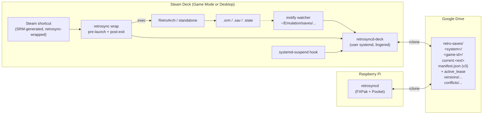

# EmuDeck Sync — Design Doc

**Status:** Draft for implementation
**Audience:** RetroSync v0.3 implementation agent
**Builds on:** [docs/design.pdf](design.pdf), [docs/pocket-sync-design.md](pocket-sync-design.md). Read both first if you haven't.

---

## TL;DR

Add the Steam Deck (running EmuDeck) as a third save source alongside
the FXPak Pro and the Analogue Pocket, syncing **bidirectionally over
WiFi**. Three layered triggers — instant on-save uploads (inotify),
pre-launch pulls (Steam ROM Manager wrapper), and suspend / reconnect
hooks — keep saves moving between devices without operator action,
target latency 5–10 seconds from in-game save to cloud.

A new **active-device lease** mechanism (introduced here, shared with
Pocket and FXPak going forward) makes mid-session handoffs safe: the
device that's actively playing a game holds a TTL'd lease in the
cloud manifest. Pre-launch on another device sees the lease, pulls
latest, and either grabs the lease (soft mode default) with a brief
operator warning or refuses to launch (hard mode opt-in) until
released. Lease auto-expires so a crashed device doesn't lock anyone
out.

EmuDeck's conventions — unified `~/Emulation/` save paths and Steam
ROM Manager-generated launch shortcuts — give us standardized hook
points without writing per-emulator integration code. The free tier
of EmuDeck is sufficient; no patron features required.

This document is the complete spec: architecture, data model, sync
algorithm, lease semantics, EmuDeck-specific integration, ROM ↔ save
reconciliation, conflict handling, configuration, migration,
implementation plan, and tests.

## 1. Goals

- **Plug-free sync.** No cables. Saves flow between Pi/FXPak Pro,
  Pocket, and Deck via the same Drive bucket over WiFi.
- **Sub-10-second push.** From the moment RetroArch flushes SRAM to
  the moment the cloud has it, no more than ~10 s in steady state.
- **Pre-launch pull guarantee.** Whenever the operator launches a game
  on the Deck (via Steam, which is how EmuDeck installs everything),
  the wrapper runs first, ensuring the local save is at-or-newer-than
  the cloud's current version before the emulator even starts.
- **Magical handoff.** Save on FXPak, walk away, Deck. Game
  resumes from the FXPak save without any manual sync action.
- **Bootstrap unfamiliar games.** Plug in a Deck that's never played a
  given game; if cloud has a save AND the Deck has the ROM, the save
  populates automatically before first launch.
- **Conflict-safe.** Genuine divergence (two devices played
  simultaneously offline) never silently overwrites. Both versions are
  preserved as conflicts pending operator decision.
- **EmuDeck-native.** Hook into EmuDeck's existing conventions; do not
  fight them or maintain a parallel install.

## 2. Non-goals (v0.3)

- **Non-EmuDeck Deck setups.** Adapter is general enough to extend, but
  the v0.3 install assumes EmuDeck's path conventions and Steam ROM
  Manager-managed launch shortcuts. Custom RetroArch installs are a
  follow-up.
- **Non-RetroArch emulators.** Adapter design is generic, but v0.3
  ships and tests RetroArch + SNES path only. Standalone emulators
  (Dolphin, RPCS3, etc.) gain support trivially in a follow-up.
- **Steam Cloud integration.** RetroArch-on-Steam can use Steam Cloud
  for some cores. We deliberately don't touch it — RetroSync is the
  single source of truth.
- **Decky Loader plugin.** A Game Mode sync indicator would be nice;
  out of scope for v0.3.
- **Wireless sync to Pocket.** Pocket has no WiFi; remains plug-and-sync.

## 3. Key new concepts

Three patterns in this doc that don't exist in v0.2 (Pocket). They're
the heart of the design.

### Pre-launch wrap

A `retrosync wrap` shell command that prefixes every emulator launch.
It receives the full emulator command line, derives a game-id from the
ROM path argument, runs a sync pass for that game (pull cloud → local
if cloud is ahead, grab the active-device lease), then `exec`s the
emulator. On exit, it flushes pending uploads and releases the lease.

This is integrated into Steam launch options via Steam ROM Manager so
every EmuDeck-managed shortcut benefits automatically.

### inotify-driven upload

A daemon (`retrosyncd-deck`, the user-systemd variant) watches the
EmuDeck save directories with `inotify`. On any `IN_CLOSE_WRITE` event
on a save file, debounces briefly (5 s — RetroArch sometimes flushes
multiple files in a burst), then fires the per-game sync logic. Steady-
state save→cloud latency is single-digit seconds.

### Active-device lease

A per-game lease object stored in the cloud manifest:

```json
"active_lease": {
  "source_id": "deck-1",
  "started_at": "2026-04-26T10:00:00Z",
  "expires_at": "2026-04-26T10:15:00Z",
  "last_heartbeat": "2026-04-26T10:08:00Z",
  "current_hash_at_lease": "addd1dcf..."
}
```

When a device starts playing a game it acquires (or refreshes) the
lease after pulling the latest cloud state. Other devices respect the
lease per the configured mode (§9). Lease has a 15 min TTL with a 5
min heartbeat while a game is active; auto-expires on crash.

The lease lives in the manifest (which we already write atomically via
rclone), so no separate locking infrastructure. It is shared by all
sources: the FXPak Pro daemon and the Pocket adapter learn to acquire
and release the lease too.

## 4. Architecture



The Deck runs its own daemon — same Python codebase as the Pi — under
user systemd with linger enabled, so it survives Game Mode and Desktop
Mode transitions and reboots. The daemon and the Pi's daemon are peers
that coordinate via the cloud manifest (lease + version history); they
never talk to each other directly.

## 5. EmuDeck conventions we depend on

EmuDeck (free, https://www.emudeck.com) sets up emulators on the Steam
Deck with a unified directory structure and Steam shortcuts generated
by Steam ROM Manager (SRM, https://steamgriddb.github.io/steam-rom-manager/).

The conventions we lean on, all stable across recent EmuDeck releases:

### 5.1 Save and ROM paths

EmuDeck stores everything under `~/Emulation/` (or the SD-card mirror
`/run/media/mmcblk0p1/Emulation/` if installed there). The
installer detects which root is in use by checking `~/Emulation/`
first then the SD path. The path is stored in
`emudeck_root` in the daemon's config.

Per-emulator save layout (RetroArch, our v0.3 target):

- ROMs: `<emudeck_root>/roms/<system>/<game>.<rom-ext>`
- Saves: `<emudeck_root>/saves/retroarch/saves/<game>.srm`
- Save states: `<emudeck_root>/saves/retroarch/states/<game>.state*`

Some EmuDeck 3.x configurations route via
`<emudeck_root>/storage/retroarch/saves/` instead. The installer
detects which one RetroArch actually uses by reading
`~/.var/app/org.libretro.RetroArch/config/retroarch/retroarch.cfg`
(or `~/.config/retroarch/retroarch.cfg` for non-Flatpak) and
extracting `savefile_directory`. That value is stored in
`saves_root` in the daemon's config and trumps any default.

Save and ROM **stems** match by EmuDeck convention: the save for
`Super Metroid (USA, Europe).sfc` is `Super Metroid (USA, Europe).srm`.
RetroArch enforces this (it derives save paths from the loaded ROM
path). This invariant is what makes the bidirectional reconciliation
in §7 tractable.

### 5.2 RetroArch core override caveat

RetroArch has a per-core option **"Save files in content directory"**
that, when enabled, places saves alongside ROMs instead of in the
unified saves dir. EmuDeck's default leaves this off. Our installer
checks the RetroArch config and, if any core has it enabled, surfaces
a warning to the user with instructions to disable it. We do **not**
silently fix it — the user may have set it intentionally.

### 5.3 Steam ROM Manager-generated shortcuts

EmuDeck installs Steam ROM Manager and ships parser configurations
that SRM uses to discover ROMs and create Steam shortcuts. Each
generated shortcut is a Steam non-Steam-game entry whose launch
command is the emulator binary plus arguments (typically
`-L <core>.so "<rom-path>"` for RetroArch).

We modify these by editing SRM's parser configurations
(`~/.config/steam-rom-manager/userData/userConfigurations.json`) to
prefix every parser's "Executable" or "Command" with our wrapper. SRM
re-generates shortcuts on the user's next "Save to Steam" run; the
wrapper is now baked in.

The user must re-run SRM once after install. setup-deck.sh prints a
clear message about this.

## 6. Data model additions

The Pocket design (v0.2) introduced manifest schema 2 with
`device_state` and `conflicts`. v0.3 adds lease support: bump to
**schema 3** with `active_lease`.

### 6.1 SQLite schema (state.db)

New columns on existing tables (additive, backward-compatible):

```sql
ALTER TABLE source_sync_state ADD COLUMN holds_lease_until TEXT;
-- For sources that grab leases, this records the local-clock time at
-- which their currently-held lease will expire. Null if not holding.
```

New table for the cross-device save filename map (§7):

```sql
CREATE TABLE IF NOT EXISTS device_filename_map (
  source_id   TEXT NOT NULL,
  game_id     TEXT NOT NULL,
  filename    TEXT NOT NULL,         -- save filename on the device,
                                     -- without the saves dir prefix
  rom_stem    TEXT,                  -- the ROM filename stem (no ext)
                                     -- the save corresponds to, when known
  observed_at TEXT NOT NULL,
  PRIMARY KEY (source_id, game_id)
);
```

This persists "for `<source>`, the canonical save filename for
`<game-id>` is `<filename>`" — populated when the source first sees a
save for that game, or when the bootstrap-pull writes a new file.

### 6.2 Manifest schema 3

Adds `active_lease`:

```json
{
  "schema": 3,
  "system": "snes",
  "game_id": "super_metroid",
  "save_filename": "Super Metroid (USA, Europe).srm",
  "current_hash": "8ad7d4173b1c5a89...",
  "updated_at": "2026-04-25T18:23:11Z",

  "device_state": {
    "fxpak-pro-1": {"last_synced_hash": "...", "last_synced_at": "..."},
    "pocket-1":    {"last_synced_hash": "...", "last_synced_at": "..."},
    "deck-1":      {"last_synced_hash": "...", "last_synced_at": "..."}
  },

  "active_lease": {
    "source_id":            "deck-1",
    "started_at":           "2026-04-26T10:00:00Z",
    "expires_at":           "2026-04-26T10:15:00Z",
    "last_heartbeat":       "2026-04-26T10:08:00Z",
    "current_hash_at_lease": "addd1dcfb88e0144..."
  },

  "versions": [...],
  "conflicts": [...]
}
```

`active_lease` may be absent (no one holds it). It is overwritten in
place by lease grabs and lease releases. The version directory
(`versions/`) is unaffected by lease churn — leases are operational
state, not history.

### 6.3 Schema migration

Manifest reader is permissive: missing `active_lease` is treated as
"no lease." Older daemons (Pi running v0.2) ignore the field
entirely; they don't grab leases yet, but their writes don't disturb
existing leases either (more on this in §17 step 3).

When a v0.3-aware daemon writes a manifest, it always emits schema 3.
v0.2 daemons can still read schema 3 by virtue of the schema 2's
"unknown fields ignored" rule.

## 7. Save filename ↔ game-id reconciliation

Critical because, unlike FXPak (where the cart stores the file at a
known cart path) or Pocket (single fixed `Saves/<core>/` dir), the
Deck has saves named after **the user's specific ROM filenames**. The
same save in the cloud has to land on disk under a name RetroArch
will discover when launching the corresponding ROM.

### 7.1 Upload direction (filename → game-id)

When the inotify watcher sees `<saves_root>/Super Metroid (USA).srm`
change:

1. Strip extension → stem = `Super Metroid (USA)`.
2. Apply `game_id.canonical_slug()` (the function introduced in the
   Pocket design at §6) → `super_metroid`.
3. Combine with the source's `system` (always `snes` for v0.3) → cloud
   path `gdrive:retro-saves/snes/super_metroid/...`.
4. Record in `device_filename_map`: `(deck-1, super_metroid)
   → "Super Metroid (USA).srm"`.

This is identical to how Pocket and FXPak work. The new piece is
caching the filename so we know what to call the file in step 7.2.

### 7.2 Download direction (game-id → filename via ROM scan)

When sync determines that cloud has a newer save for game-id
`chrono_trigger` and the Deck doesn't have a save for that game yet
(bootstrap), we must answer: **what filename do we write to under
`<saves_root>/`?**

The answer must match the ROM filename stem so RetroArch finds it on
launch. Algorithm:

1. Check `device_filename_map` for `(deck-1, chrono_trigger)`. If a
   prior filename is recorded, reuse that stem.
2. Else scan `<emudeck_root>/roms/<system>/`. For each ROM file:
   - Compute its stem's canonical slug.
   - If it matches the target game-id, the save filename is
     `<rom-stem><save-ext>`. Save-ext is system-specific
     (`.srm` for SNES per RetroArch conventions).
3. If multiple ROM files match (regional dumps, etc.):
   - Prefer one whose stem normalizes WITHOUT alias-stripping (i.e.,
     the most "literal" match) — usually the user's primary copy.
   - Tie-break by file mtime (most recently used).
   - Log the choice at INFO level so the operator can see what we
     picked.
4. If no ROM file matches: skip the bootstrap-pull, log a WARNING
   ("cloud has a save for `<game-id>` but no ROM found on Deck; not
   downloading"). The save stays in cloud; if the user later adds the
   ROM, the next sync pass will populate.

Cache the result in `device_filename_map` so subsequent passes don't
re-scan.

### 7.3 Filename map cache and invalidation

ROM filename can change (user redumps, gets a different release,
renames). Stale cache would write to a non-existent stem.

Mitigation:

- On every bootstrap-pull, verify the ROM file still exists. If not,
  invalidate that map entry and re-scan.
- Provide a `retrosync filename-map invalidate <source> <game-id>`
  CLI to manually clear an entry.
- Periodic reconciliation (daily): walk `device_filename_map` and
  invalidate entries whose ROM is gone. Cheap.

## 8. Sync triggering

### 8.1 Layer 1 — inotify watcher (steady-state push)

`retrosyncd-deck` registers an `inotify(7)` watch on
`<saves_root>` recursively for `IN_CLOSE_WRITE` and `IN_MOVED_TO`
events. (`IN_MOVED_TO` covers atomic-rename save patterns.)

On event:

1. Match the file path against the configured save extensions per
   system (default `.srm` for SNES). Skip non-matches.
2. Apply a **5 s debounce** keyed by the (source, game-id) tuple.
   Successive events within the window restart the timer. RetroArch
   may write a save plus a save-state plus another related file in
   close succession; we wait for the burst to settle.
3. Once stable, trigger `sync.sync_one_game(source, game_id)` per the
   shared engine.

The debounce window is shorter than the Pi's 90 s "torn write" wait
because the Deck save isn't subject to torn writes (RetroArch writes
atomically via rename, not partial in-place updates), and the
operator wants near-instant cloud reflection.

### 8.2 Layer 2 — pre-launch wrap (zero-conflict for the happy path)

`retrosync wrap` is a CLI subcommand that the SRM-generated launch
shortcuts invoke as a prefix. Full spec in §12. From the trigger
perspective:

1. Wrapper parses the trailing args to find the ROM path → derives
   `(system, game-id)` via canonical slug.
2. Runs a synchronous pre-launch sync:
   - Pull cloud manifest.
   - If cloud's `current_hash` differs from local hash for this game,
     proceed per the §9 lease + §6.1 device_state matrix:
     - Local fast-forward → write cloud's current to local.
     - Local fast-forward conflict → record conflict, refuse launch
       (or warn-and-continue per lease mode).
3. Acquire the active-device lease for this game (§9.3).
4. `exec` the emulator with original args.
5. Post-exit (handled by a trap on the wrapper script): flush any
   in-flight save uploads, release the lease.

### 8.3 Layer 3 — suspend / network reconnect (defense in depth)

systemd-suspend hook installed at
`~/.config/systemd/user/retrosyncd-suspend.service`:

```ini
[Unit]
Description=RetroSync — flush pending saves before suspend
Before=sleep.target
StopWhenUnneeded=yes

[Service]
Type=oneshot
ExecStart=/usr/bin/env retrosync flush --timeout=10s
RemainAfterExit=yes

[Install]
WantedBy=sleep.target
```

`retrosync flush` walks the in-memory pending-upload queue and forces
all current rclone uploads to completion (or 10 s timeout). On
sleeping mid-upload without this, we'd silently lose the upload until
the next inotify event re-detects the file.

Network reconnect uses NetworkManager-dispatcher:

```bash
# /etc/NetworkManager/dispatcher.d/99-retrosync
case "$2" in up)
  systemctl --user --machine=deck@.host start retrosync-reconnect.service
  ;;
esac
```

`retrosync-reconnect.service` is a oneshot that calls
`retrosync sync-pending` — re-attempting any uploads that errored
during the offline window, plus a quick manifest-only pull of every
game in active rotation to detect upstream changes.

## 9. Active-device lease

The pre-launch pull guarantees that **at the moment of launch**, local
matches cloud. The lease guarantees that **between launch and exit**,
no other device silently overwrites cloud while we're playing.

### 9.1 Lease format

See §6.2. Stored in the per-game manifest. Atomic rclone manifest
writes serve as our atomic-CAS primitive — race conditions between
two devices grabbing the same lease are resolved by Drive's last-
writer-wins on the manifest.json upload.

### 9.2 Lifecycle

```
            grab               heartbeat        release
launch ──▶ acquire_lease() ──▶ every 5min ──▶ release_lease()
                │                                  │
                └─► writes active_lease ◀──────────┘
                                │
                                └─ if last_heartbeat older than
                                   expires_at → lease is stale,
                                   any device may steal it
```

`acquire_lease(game_id)`:

1. Pull manifest.
2. If `active_lease` is null OR expired (now > expires_at) OR same
   source_id → write our own lease block:
   - `started_at`, `last_heartbeat` = now
   - `expires_at` = now + 15 min
   - `current_hash_at_lease` = manifest's current_hash
3. Upload manifest. Return success.
4. Else (someone else holds a non-expired lease):
   - Mode = soft: log a WARNING with details, return "contested" but
     proceed. Caller decides whether to override (wrapper always does
     in soft mode).
   - Mode = hard: return "contested", caller blocks the operation.

`heartbeat()`:

1. Pull manifest.
2. If active_lease.source_id matches us → update last_heartbeat and
   expires_at, upload manifest.
3. Else (lease has been stolen, or we got expired) → log, abandon.
   Caller decides whether to re-acquire.

`release_lease(game_id)`:

1. Pull manifest.
2. If active_lease.source_id is us → set active_lease = null, upload.
3. Else → log info, do nothing (already released or stolen).

### 9.3 Soft mode default

Configured via `lease.mode` in `config.yaml`:

```yaml
lease:
  mode: soft           # soft | hard
  ttl_minutes: 15
  heartbeat_minutes: 5
```

In soft mode, the wrapper proceeds even on lease contention but
surfaces a clear notification:

```
[retrosync] heads up: pi (FXPak Pro) is currently active for
'Super Metroid' (last heartbeat 2 min ago). Pulling latest cloud save
and continuing. Press Ctrl-C in 5s to abort.
```

The 5s pause gives the operator a chance to stop. In hard mode:

```
[retrosync] error: pi (FXPak Pro) holds the active lease for
'Super Metroid'. Wait until they finish or run:
  retrosync lease release pi:super_metroid --force
```

…and the wrapper exits non-zero, preventing the emulator from launching.

### 9.4 Lease-aware FXPak and Pocket

The Pi's FXPak orchestrator is updated to:

- Acquire the lease on cart-attach (when SNI's `Attach` first succeeds
  after a period of unhealthy → as a proxy for "console just turned on").
- Heartbeat every 5 min while polling sees no errors.
- Release on cart-detach (Attach starts failing again).

The Pocket adapter acquires the lease at sync-start for each game it
processes and releases at sync-end (typically 10–60 s for the whole
batch; very short-lived).

The Pi v0.2 daemon (pre-update) is unaware of leases. It will overwrite
lease entries with absent ones when it writes manifests. Mitigation:
**don't touch active_lease on manifest writes from non-lease-aware
sources.** v0.3 daemon's manifest writer preserves existing
active_lease unless explicitly modifying it. The transition window
(some sources lease-aware, others not) is brief — the rollout sequence
in §17 ensures the Pi is updated before the Deck enters production.

## 10. Components / files

```
retrosync/
├── sources/
│   ├── emudeck.py          NEW — EmuDeckSource adapter
│   ├── pocket.py           CHANGED — lease integration
│   └── fxpak.py            CHANGED — lease integration on attach/detach
├── leases.py               NEW — acquire/heartbeat/release
├── sync.py                 CHANGED — consult lease before writes
├── inotify_watch.py        NEW — inotify wrapper, debounced event delivery
├── filename_map.py         NEW — device_filename_map storage + ROM scan
├── deck/
│   ├── __init__.py
│   ├── wrap.py             NEW — retrosync wrap subcommand impl
│   ├── srm.py              NEW — SRM config patcher
│   ├── emudeck_paths.py    NEW — root + saves_root detection
│   └── flush.py            NEW — pre-suspend flush
├── cli.py                  CHANGED — wrap, flush, lease subcommands
├── state.py                CHANGED — new column + table per §6.1
├── cloud.py                CHANGED — manifest schema 3, lease helpers
└── notify.py               CHANGED — lease-contended notification

install/
├── setup-deck.sh           NEW — Deck-specific installer
├── systemd-user/
│   ├── retrosyncd-deck.service                NEW
│   └── retrosyncd-suspend.service             NEW
├── networkmanager/
│   └── 99-retrosync                           NEW — reconnect dispatcher
└── srm-config-patch.json                      NEW — JSON patches for SRM config

docs/
└── emudeck-sync-design.md                     THIS FILE
```

## 11. EmuDeckSource adapter

```python
class EmuDeckSource(SaveSource):
    """Watches an EmuDeck saves directory for one system. The Deck-side
    daemon registers one EmuDeckSource per system the operator wants
    synced (typically just snes for v0.3)."""

    def __init__(self, *, id: str, system: str,
                 saves_root: str, roms_root: str,
                 save_extension: str = ".srm",
                 inotify: InotifyWatcher | None = None):
        self.id = id
        self.system = system
        self._saves_root = Path(saves_root)
        self._roms_root = Path(roms_root)
        self._ext = save_extension
        self._inotify = inotify

    async def health(self) -> HealthStatus:
        if not self._saves_root.is_dir():
            return HealthStatus(False, f"saves_root missing: {self._saves_root}")
        return HealthStatus(True, f"watching {self._saves_root}")

    async def list_saves(self) -> list[SaveRef]:
        return [SaveRef(path=str(p)) for p in self._saves_root.iterdir()
                if p.is_file() and p.suffix.lower() == self._ext]

    async def read_save(self, ref: SaveRef) -> bytes:
        return Path(ref.path).read_bytes()

    async def write_save(self, ref: SaveRef, data: bytes) -> None:
        # Atomic-rename pattern for safety.
        target = Path(ref.path)
        target.parent.mkdir(parents=True, exist_ok=True)
        tmp = target.with_suffix(target.suffix + ".retrosync-tmp")
        tmp.write_bytes(data)
        os.replace(tmp, target)

    def resolve_game_id(self, ref: SaveRef) -> str:
        from ..game_id import canonical_slug
        return canonical_slug(Path(ref.path).stem)

    # ---- adapter-specific (called by sync engine via duck typing) ----

    def filename_for(self, game_id: str) -> str:
        """Given a game_id, return the basename to write to under
        saves_root for a bootstrap pull. Implements the §7.2 algorithm."""
        ...
```

The adapter does not start the inotify watcher itself; it accepts an
`InotifyWatcher` injected by the daemon, so multiple sources can share
a single watcher.

## 12. `retrosync wrap` subcommand

Full spec.

### 12.1 Invocation

```
retrosync wrap [--timeout-pre 10s] [--timeout-post 30s] -- <emulator-cmd...>
```

`--` separates wrap's own options from the emulator command. Wrap
treats everything after `--` as the verbatim command to run after
pre-launch sync.

### 12.2 Game-id derivation

Wrap searches the `<emulator-cmd...>` for the first argument that:

1. Is a path that exists on disk.
2. Has an extension matching a known ROM extension (`.sfc`, `.smc`,
   `.swc`, `.fig`, `.gb`, `.gbc`, `.gba`, `.nes`, `.md`, `.gen`, etc.).
3. Lives under `<emudeck_root>/roms/<system>/` (so `system` is
   derivable from the path).

If none match, wrap logs a warning and falls back to "no sync for this
launch", but still execs the emulator. The user's game launches no
matter what — sync issues never block play.

### 12.3 Pre-launch flow

```python
def wrap_main(argv):
    cmd = parse_double_dash(argv)
    rom_path, system, game_id = derive(cmd) or (None, None, None)
    if game_id:
        try:
            with timeout(args.timeout_pre):
                sync.sync_one_game(source=local_emudeck_source,
                                   game_id=game_id,
                                   role="pre-launch")
                lease = leases.acquire(source_id=SOURCE_ID,
                                       game_id=game_id,
                                       mode=config.lease.mode)
        except LeaseContended as e:
            handle_contended_per_mode(e)   # may proceed (soft) or exit (hard)
        except (TimeoutError, CloudError) as e:
            log.warning("pre-launch sync failed: %s; launching with stale local", e)
    return os.execvp(cmd[0], cmd)          # never returns on success
```

The `os.execvp` replaces wrap's own process with the emulator.
Steam's process tracker sees the emulator directly; no extra layer
breaking Steam's "game running" state.

### 12.4 Post-exit flow

Because `execvp` replaces the process, post-exit cleanup needs a
different mechanism. Two options:

- **Bash trap wrapper** (chosen): `retrosync wrap` is implemented as a
  small bash script that fork-execs the emulator (rather than
  `os.execvp` of a Python child) and traps EXIT to fire the
  post-exit logic via `retrosync wrap-post`. Steam still tracks the
  bash process; when the emulator exits, the bash exits, Steam sees
  the game stop. Slightly more layering but post-exit hooks are
  reliable.

- **systemd-user transient unit**: launch the emulator as a child of
  a `systemd-run --user --scope` unit, hook ExecStopPost. More plumbing.

Wrap as bash-trap script:

```bash
#!/usr/bin/env bash
# /usr/local/bin/retrosync-wrap (the wrap subcommand may itself dispatch
# here for the bash-trap variant).
set -e
SOURCE_ID="${RETROSYNC_DECK_SOURCE_ID:-deck-1}"
ARGS=("$@")
ROM_PATH="$(retrosync wrap-extract-rom -- "${ARGS[@]}")"
GAME_ID="$(retrosync wrap-derive-game-id "$ROM_PATH" 2>/dev/null || true)"

cleanup() {
  if [[ -n "$GAME_ID" ]]; then
    retrosync wrap-post "$SOURCE_ID" "$GAME_ID" --timeout 30 || true
  fi
}
trap cleanup EXIT

if [[ -n "$GAME_ID" ]]; then
  retrosync wrap-pre "$SOURCE_ID" "$GAME_ID" --timeout 10 || true
fi
"${ARGS[@]}"
```

(This version uses three Python helper subcommands: `wrap-extract-rom`,
`wrap-derive-game-id`, `wrap-pre`, `wrap-post`. Cleanly separates
arg-parsing concerns from the bash trap structure.)

## 13. SRM config patching

EmuDeck installs SRM and ships parser configurations. The Deck installer
patches these to insert our wrapper.

### 13.1 SRM userConfigurations.json structure

SRM stores parsers as JSON like:

```json
{
  "parserType": "Manual",
  "configTitle": "EmuDeck - SNES",
  "executable": {"path": "${RETROARCH}", "appendArgsToExecutable": true},
  "executableArgs": "-L ${LIBRETRO_CORE} \"${ROM_DIR}/${TITLE}.${EXTENSION}\"",
  ...
}
```

Our patcher rewrites the `executable.path` to point at our wrapper and
prepends the original path to `executableArgs`:

```json
{
  "executable": {"path": "/usr/local/bin/retrosync-wrap", "appendArgsToExecutable": true},
  "executableArgs": "-- \"${RETROARCH}\" -L ${LIBRETRO_CORE} \"${ROM_DIR}/${TITLE}.${EXTENSION}\"",
  ...
}
```

The leading `--` is what `retrosync wrap` uses to separate its own
options from the emulator command. SRM's variable expansion happens
before our wrapper sees the args.

### 13.2 Patch idempotency

The patcher detects already-wrapped parsers (looks for
`/usr/local/bin/retrosync-wrap` in the executable path) and leaves
them alone. This means `setup-deck.sh` is safe to re-run.

A `--unpatch` flag reverses the change (for uninstall or debugging).

### 13.3 User confirmation

Patching SRM config is invisible until the user re-runs SRM's "Save
to Steam" step. setup-deck.sh prints:

```
SRM parser configurations have been patched. To apply, open Steam ROM
Manager (under EmuDeck → Tools), click "Add Games" → "Parse" →
"Save to Steam". You should not see any errors. After this, every
emulator launch through Steam will sync via RetroSync automatically.
```

## 14. setup-deck.sh

End-to-end installer for the Deck. Run from a terminal in Desktop
Mode (Game Mode has no shell). Idempotent.

### 14.1 What it does

```
1. Detect SteamOS (Arch-based, read-only /usr).
2. Detect EmuDeck install (~/Emulation/ or SD path).
3. Install dependencies via flatpak / pip-user fallback (since pacman
   is read-only on SteamOS):
     - python (already shipped)
     - inotify-tools
     - rclone (download static binary to ~/.local/bin/)
4. Clone repo to ~/.local/share/retrosync (or pull if present).
5. Build venv at ~/.local/share/retrosync/.venv.
6. Install retrosync package + wrapper scripts to ~/.local/bin/.
7. Configure rclone (separate Drive remote per device — see §15.4).
8. Install user systemd units, enable, start:
     - retrosyncd-deck.service
     - retrosyncd-suspend.service
9. loginctl enable-linger deck so services survive logout.
10. Patch SRM parser configurations.
11. Print user-action message to re-run SRM.
12. Verify: retrosync test-cloud, retrosync test-cart deck-1.
```

### 14.2 SteamOS read-only quirks

- `/usr` is read-only. Install everything to `~/.local/`.
- pacman package install requires `sudo steamos-readonly disable`,
  which is overkill for our deps. We avoid it by:
  - inotify-tools is present on SteamOS by default.
  - rclone is downloaded as a static binary into
    `~/.local/bin/rclone` rather than installed via pacman.
  - python venv lives in user space already.
- `/etc/sudoers.d/` is on the read-only partition. We don't need
  sudoers entries on Deck — the daemon and wrapper run as the user
  (no privilege escalation needed; saves dir is user-owned).

### 14.3 systemd user units

Saved to `~/.config/systemd/user/`:

```ini
# retrosyncd-deck.service
[Unit]
Description=RetroSync — Deck daemon (inotify-based)
After=network-online.target
Wants=network-online.target

[Service]
Type=simple
ExecStart=%h/.local/bin/retrosyncd --config %h/.config/retrosync/config.yaml
Restart=always
RestartSec=5

[Install]
WantedBy=default.target
```

```ini
# retrosyncd-suspend.service
[Unit]
Description=RetroSync — flush before suspend
Before=sleep.target
StopWhenUnneeded=yes

[Service]
Type=oneshot
ExecStart=%h/.local/bin/retrosync flush --timeout=10s
RemainAfterExit=yes

[Install]
WantedBy=sleep.target
```

`loginctl enable-linger deck` is required for these to run while the
Deck is in Game Mode (no logged-in tty).

## 15. Operator UX

### 15.1 First-time setup walkthrough

```
$ git clone https://github.com/indiefan/RetroSync.git
$ cd RetroSync
$ bash install/setup-deck.sh
[setup-deck] detected EmuDeck root at /home/deck/Emulation
[setup-deck] detected RetroArch saves at /home/deck/Emulation/saves/retroarch/saves
[setup-deck] downloading rclone...
[setup-deck] configuring rclone Google Drive remote...
[follow rclone OAuth flow in browser]
[setup-deck] patching Steam ROM Manager parser configurations...
[setup-deck] installing user systemd units...
[setup-deck] enabling linger so services persist in Game Mode...
[setup-deck] starting retrosyncd-deck.service...
[setup-deck] OK. Daemon is running.

NEXT STEP: open Steam ROM Manager (EmuDeck → Tools → Steam ROM Manager),
click "Add Games" → "Parse" → "Save to Steam". This re-generates your
shortcuts with the RetroSync wrapper baked in. After that, every game
you launch from Steam syncs automatically.
```

### 15.2 Day-to-day commands

```bash
retrosync status                      # daemon-wide summary, includes
                                      # active leases
retrosync sync-status                 # last-synced summary per game
retrosync lease list                  # currently held leases (any device)
retrosync lease release <source>:<game-id>   # force-release
retrosync flush                       # blocks until pending uploads done
retrosync upgrade                     # git pull + setup re-run
```

### 15.3 Notifications

`notify.on_lease_contended` config option (defaults to `journald`,
extends to `pushover` etc.). When the wrapper detects contention in
soft mode, it both prints to stderr (visible briefly in Steam Game
Mode "Loading…" overlay) AND emits a journal log line (visible later
via `journalctl --user -u retrosyncd-deck`).

### 15.4 Per-device rclone setup

The Deck uses its own rclone remote, separate refresh token. Setup
runs `rclone config` interactively. Same Drive bucket as the Pi:

```yaml
# config.yaml on the Deck
cloud:
  rclone_remote: "gdrive:retro-saves"   # SAME as Pi
  rclone_config_path: "/home/deck/.config/rclone/rclone.conf"
```

If the operator wants to share a single OAuth across devices (less
typical, but supported): copy the Pi's rclone.conf to the Deck. Both
devices then use the same refresh token. Not recommended — if Drive
revokes the token, both devices break at once.

## 16. Migration / coexistence

### 16.1 Coexisting with Pi v0.2

While the Pi runs v0.2 (no lease awareness):

- v0.3 manifest writes preserve existing `active_lease` if not
  modifying it (i.e., we never accidentally clear someone's lease
  through a manifest write that doesn't touch it).
- v0.2 daemon writes to manifests will drop the `active_lease` field
  (v0.2 doesn't emit it). This is OK in soft mode (worst case: a
  contention warning is missed). In hard mode, this would break
  enforcement temporarily — so hard mode is recommended only after
  rolling v0.3 to all devices.

### 16.2 Coexisting with EmuDeck Cloud Save (paid)

If the user has previously configured EmuDeck's paid cloud save,
disable it before installing RetroSync on the Deck. They can't
coexist — both would try to read/write the same save files in
incompatible ways.

setup-deck.sh checks for EmuDeck Cloud's marker files and, if found,
prints a clear warning and exits unless `--force` is passed.

### 16.3 Existing FXPak cloud history

No migration needed for cloud data — the Deck adapter writes to the
same `<system>/<game-id>/...` paths the FXPak/Pocket use. Slug
normalization is the same, so games that already exist in cloud (e.g.
`super_metroid`) get extended by Deck's contributions automatically.

## 17. Implementation plan (handoff to agent)

In dependency order. Each step independently mergeable.

### Step 1 — Lease module + manifest schema 3
- `retrosync/leases.py` with `acquire`, `heartbeat`, `release`,
  `is_held_by_other`.
- Schema bump for `Manifest` (cloud.py): add `active_lease` field.
  Reader accepts both schema 2 and 3.
- Update `RcloneCloud.write_manifest()` to preserve unmodified
  `active_lease` when writing (read-modify-write).
- Add `lease.mode | ttl_minutes | heartbeat_minutes` to config.
- **Test:** lease acquire succeeds on empty manifest, fails on held
  manifest in hard mode, succeeds with warning in soft mode. Stale
  lease (now > expires_at) is reclaimable.

### Step 2 — `retrosync lease` CLI subcommands
- `lease list` (across all manifests, useful for triage)
- `lease show <source>:<game-id>`
- `lease release <source>:<game-id> [--force]`
- **Test:** lease lifecycle round-trip.

### Step 3 — Lease integration in Pi (FXPak + Pocket)
- FXPak: acquire on cart-attach success; heartbeat in poll loop;
  release on cart-detach.
- Pocket: acquire at sync start per game; release at sync end per game.
- **Test:** dry_run with two simulated sources tries to play same
  game; second source sees contention.

### Step 4 — Filename map + ROM scan
- `retrosync/filename_map.py` with the §7 algorithm.
- `device_filename_map` table + migrations.
- `retrosync filename-map list/invalidate` CLI.
- **Test:** populate roms_root with three SNES dumps, ask filename
  for a game-id, get the right `.srm` name.

### Step 5 — inotify watcher
- `retrosync/inotify_watch.py`. Wraps `inotify_simple` (or the stdlib
  `select` + `inotify` syscalls).
- Debounce per (source, game-id) for 5s; fires `sync_one_game`.
- **Test:** unit test that simulates `IN_CLOSE_WRITE` events; verifies
  one sync invocation per debounced burst.

### Step 6 — EmuDeckSource adapter
- `retrosync/sources/emudeck.py` per §11.
- Lazy adapter registration. Config parses `emudeck_root` /
  `saves_root` / `roms_root` / `system`.
- **Test:** dry_run with fixture EmuDeck-style filesystem layout.

### Step 7 — Path detection (emudeck_paths.py)
- Detect `~/Emulation/` vs SD-card mirror.
- Read RetroArch's `retroarch.cfg` for `savefile_directory`.
- Emit clear errors if EmuDeck not detected.

### Step 8 — `retrosync wrap` subcommand + bash dispatcher
- `retrosync wrap-extract-rom`, `wrap-derive-game-id`, `wrap-pre`,
  `wrap-post`.
- Bash wrapper at `/usr/local/bin/retrosync-wrap` per §12.4 (installed
  to `~/.local/bin/retrosync-wrap` on Deck since /usr is read-only).
- **Test:** unit test the rom extractor against synthetic EmuDeck
  command lines.

### Step 9 — SRM config patcher (deck/srm.py)
- JSON patch logic per §13.
- Idempotent. `--unpatch` flag.
- **Test:** patch a sample SRM config, verify expected output.
  Re-patch, verify no-op.

### Step 10 — setup-deck.sh
- All the steps in §14.1.
- Detect SteamOS, EmuDeck, RetroArch saves dir.
- Install rclone, venv, units, run rclone config, patch SRM.
- **Test:** run on a real Deck; verify `journalctl --user -u
  retrosyncd-deck` shows watcher started and inotify is active.

### Step 11 — Suspend hook + NetworkManager dispatcher
- systemd-user unit per §8.3.
- NetworkManager dispatcher script.
- `retrosync flush` and `retrosync sync-pending` CLI helpers.
- **Test:** `systemctl --user start retrosyncd-suspend` runs without
  error; suspend/resume on real hardware works.

### Step 12 — Hard mode + notifications
- Config plumbing for `lease.mode = hard`.
- Pluggable notify backends (journald default, pushover stub).
- **Test:** in hard mode, contended wrap exits non-zero; in soft mode,
  same scenario succeeds with warning.

### Step 13 — End-to-end manual test on real hardware
- Save on FXPak; observe Deck pulls it on next launch.
- Save on Deck; observe Pi pulls it within 30 s.
- Plug in Pocket; observe it pulls latest cloud version.
- Simulate concurrency: launch on FXPak, then immediately on Deck;
  observe contention warning, no overwrite.

### Step 14 — Documentation + verification
- Update README with Deck section.
- Document RetroArch "Save files in content directory" footgun.
- Verify EmuDeck Cloud Save coexistence detection works.

## 18. Testing strategy

### 18.1 Dry-run extensions (in-sandbox)

`tests/dry_run.py` grows fixtures for an EmuDeck-like filesystem:

```
tests/fixtures/deck/
├── Emulation/
│   ├── roms/snes/
│   │   ├── Super Metroid (USA, Europe).sfc
│   │   ├── Chrono Trigger (U).sfc
│   │   └── A Link to the Past.sfc
│   └── saves/retroarch/saves/
│       └── Super Metroid (USA, Europe).srm
└── steam-rom-manager/userData/userConfigurations.json
```

Test scenarios (each as a separate phase like the FXPak dry-run):

- **Phase A**: First-run, save exists on Deck → upload to cloud.
- **Phase B**: Save changes on Deck → debounced upload.
- **Phase C**: Save in cloud, none on Deck, ROM exists → bootstrap-pull
  writes correct filename.
- **Phase D**: Save in cloud, none on Deck, no ROM → skip with warning.
- **Phase E**: Concurrent leases — two simulated sources try to
  acquire same game-id; second one warns (soft) or fails (hard).
- **Phase F**: Stale lease (mtime > 15 min ago); a new acquire reclaims.
- **Phase G**: Wrapper integration — feed a synthetic command line
  through `wrap-extract-rom`, verify game-id is correct.

### 18.2 Real-hardware tests

Step 13 in the implementation plan. Single operator test rig:

- Pi with FXPak Pro on SNES.
- Steam Deck with EmuDeck + RetroArch + matching SNES ROM library.
- Both pointed at same Drive bucket.
- 5 SNES games for which both devices have the ROM.

Test matrix: see step 13 in the plan.

## 19. Open questions / future

- **Multiple cores per system on Deck.** The user might run SNES on
  RetroArch's snes9x core for some games and bsnes for others. Both
  cores write the same `.srm` filename to the same saves dir, so this
  is a non-issue. Documented in case the agent wonders.
- **Game Mode UX.** A Decky Loader plugin showing a sync indicator in
  Game Mode would be lovely. v0.4 candidate.
- **Per-system save-extension overrides.** Some emulators write
  `.sav` instead of `.srm` for the same content. Config field already
  in place (`save_extension`). The default for SNES is `.srm`.
- **Save state files.** RetroArch writes `.state*` files alongside
  `.srm`. v0.3 syncs only `.srm`; save states are intentionally local-
  only since they can be incompatible across cores or core versions.
  Operator override exists if they really want.
- **Mac client.** A Mac-side companion that drops in the same model
  for emulators on macOS would unify everything. Not needed in v0.3.
- **Bandwidth / rate limiting.** Deck cellular tethering is plausible.
  Add `cloud.transfer_max_kbps` to config so the operator can cap
  rclone's bandwidth on metered connections.
- **What if SRM is reinstalled by the user (e.g., after EmuDeck
  upgrade) and our patches are lost?** Operator runs
  `retrosync upgrade` (or directly `retrosync deck patch-srm`); the
  patcher is idempotent.

## 20. Appendix: example flows

### A. Steady-state save on Deck while playing

1. Operator launches "Super Metroid" via Steam.
2. SRM-generated shortcut runs `retrosync-wrap -- retroarch -L ... rom`.
3. Wrap derives game-id `super_metroid`, runs pre-launch sync:
   - Pulls cloud manifest. Cloud current = local current. No-op.
   - Acquires lease for `super_metroid` as `deck-1`.
4. Wrap execs RetroArch.
5. Operator plays for 20 min, saves in-game.
6. RetroArch flushes to disk → `IN_CLOSE_WRITE` →
   inotify watcher fires.
7. Watcher debounces 5 s, then calls `sync.sync_one_game(deck-1, super_metroid)`.
8. Engine sees H_dev != H_cloud, H_last == H_cloud (cloud unchanged
   since pre-launch pull) → fast-forward upload.
9. Cloud now has new version. Pi's daemon picks it up on its next 30 s
   poll, pulls down to the FXPak cart (since cart isn't currently
   playing — soft lease respected).
10. Operator quits emulator.
11. Wrap's bash trap fires `retrosync wrap-post`:
    - Flushes any in-flight uploads.
    - Releases lease.
12. Deck daemon idle until next event.

### B. Handoff Deck → FXPak Pro

1. Operator quits Super Metroid on Deck (per A above; Deck's lease
   released).
2. 30 seconds later, operator turns on the SNES.
3. Pi's daemon detects cart-attach success.
4. Pi grabs lease for `super_metroid` (no contention; was just released).
5. Pi's normal poll cycle runs: H_cart != H_cloud → pull cloud's
   current to cart via `usb2snes PutFile`.
6. SNES boots Super Metroid, loads SRAM that was just written. The
   user resumes from the Deck save.

### C. Conflict scenario

1. Operator plays on Deck offline (no WiFi). Pre-launch pull failed
   silently; wrap proceeded with stale local. Saved several times.
2. Meanwhile, operator's friend played on FXPak (somehow), saved.
   Pi's daemon uploaded.
3. Operator gets WiFi back on Deck, daemon's reconnect hook fires
   `sync-pending`.
4. For super_metroid: H_dev != H_cloud, H_last != H_cloud
   (cloud changed during outage) AND H_last != H_dev (device changed
   too) → conflict.
5. Engine writes Deck's current bytes to
   `gdrive:retro-saves/snes/super_metroid/conflicts/2026-04-26T11-30-00Z--abc12345--from-deck-1.srm`.
6. Manifest gets a `conflicts` entry. Operator notification fires.
7. Operator runs `retrosync conflicts list`, sees the conflict, picks
   the winner via `retrosync conflicts resolve <id> --winner deck`.
8. Cloud's `current.srm` becomes the deck-side bytes. Both device's
   `last_synced_hash` are reset; next sync converges.

---

## 21. Addendum: post-implementation refinements

Sections 1–20 describe the design as drafted. This addendum captures
what actually shipped and the bugs / use-cases the original draft
didn't anticipate. Wherever this section contradicts the earlier
spec, the addendum is correct for the current code.

The implementation lives across PRs #19, #20, #21, #22, #23, #24, #25,
#26, #27, #28 — roughly chronological order of operator-driven
discoveries during a real Deck install.

### 21.1. `retrosync promote <game> <selector>` — operator escape hatch

**New CLI command not in the design.** Forces any historical version
to become cloud's `current.<ext>`. The selector is one of:

- A hash (full sha256 or 8-char prefix matching `retrosync versions`).
- A cloud path (e.g. `gdrive:.../versions/snes/...--<hash8>.srm`).

Mechanism:

1. Resolve the selector → cloud path. Tries `state.db` first, then
   scans cloud's `versions/` (and per-`device_kind` subfolders) so
   promote works cross-source: the Pi can promote a Deck-uploaded
   version even though the Pi's `state.db` doesn't have a row for it.
2. Download the bytes; verify hash matches the selector.
3. Overwrite cloud's `current.<ext>`.
4. Patch the manifest's `current_hash` to the promoted hash.

Critically, promote **does not** bump any source's
`source_sync_state.last_synced_hash`. That was a deliberate revision
from a first-cut implementation that did bump them — bumping
mis-triggers case 5 on the next sync (engine sees "device advanced
from promoted to its-stale-prior" and uploads stale bytes back,
undoing the promote). Leaving `last_synced_hash` alone gives every
keeping-up device case 6 (cloud advanced, device unchanged → pull)
on the next sync, which is exactly the desired behavior.

Use case driving its existence: a stale-SRAM device uploaded a blank
save that became cloud's current; the operator needs to revert. Was
previously a multi-step "stop daemon → pull bytes → write to device →
restart daemon" cookbook (cf. pocket-sync-design §16.17); now one
command.

### 21.2. `_pull_to_device` self-heal on manifest/current.srm desync

**New mechanism not in the design.** Cross-source manifest writes can
race: each device's `refresh_manifest` writes its own view of
`current_hash`, and a stale view can overwrite a fresh one. Concrete
incident from a real install:

- Deck uploads `8eb431ab`; cloud `current.srm` becomes those bytes;
  Deck's `refresh_manifest` writes `current_hash=8eb431ab`. Consistent.
- Pi runs a pass. Pi's local `current_hash` for the cart is still
  `fb5ae542` (Pi's stale view from before catching up). Pi's
  `refresh_manifest` writes `current_hash=fb5ae542`, **clobbering**
  Deck's manifest write.
- Now `manifest.current_hash = fb5ae542` but `current.srm` bytes hash
  to `8eb431ab`. Next pull throws `CloudError("download hash mismatch
  for current.srm: manifest says fb5ae542, got 8eb431ab")`.

The actual bytes at `current.<ext>` are the truth; the manifest's
`current_hash` is metadata. `_pull_to_device` now:

- Logs a warning when the actual hash differs from `expected_hash`.
- Trusts the downloaded bytes; writes them to the device.
- Updates `state.db.current_hash` to the **actual** hash.
- Returns the actual hash so callers can `set_sync_state` to match.

The next `refresh_manifest` pass writes a manifest whose `current_hash`
matches reality, repairing the cloud-side desync automatically. The
underlying race (cross-source manifest writes overwriting each
other's `current_hash`) is still latent for uploads; this is a
tactical fix that breaks the loop on pulls. A proper fix is tracked
as future work — likely splitting `current_hash` updates from the
rest of the manifest refresh so only the writer of `current.<ext>`
touches it.

### 21.3. `cloud_wins_on_diverged_device` — case 7 inverse priority

**New config option not in the design.** Mirror of
`cloud_wins_on_unknown_device` for case 7 (both moved since last
agreed hash):

```yaml
cloud_wins_on_diverged_device: true   # off by default
```

Default behavior (the design's spec) routes case 7 through
`conflict_winner`. With the typical `conflict_winner: device`, case 7
auto-resolves by uploading the device's bytes — fine when those bytes
are a deliberate save, **wrong** when they're session noise (a
power-cycle artifact, a different game's autosave leftover, the cart
hot-swap residue). The operator hit exactly this: the FXPak's
unrelated post-power-on bytes overwrote a deliberate Deck save.

With `cloud_wins_on_diverged_device: true`, case 7 instead:

- Uploads the device's bytes to `versions/<device-kind>/...` with
  `update_current=False` (recoverable via `retrosync promote`).
- Pulls cloud's current to the device (when `cloud_to_device` is on).
- Sets `last_synced_hash` to the actual hash from the pull
  (interacts with §21.2's self-heal).

**Recommended on the Pi/FXPak side** for the reason above. Less
useful on the Deck where local edits via wrap-pre + inotify almost
always represent deliberate in-game saves.

### 21.4. `InotifyOrchestrator` periodic re-scan

**New mechanism not in the design.** New config knob:

```yaml
orchestrator:
  inotify_rescan_sec: 60   # 0 to disable
```

The design's `InotifyOrchestrator` was purely event-driven on local
file changes — but cross-device promotes / uploads to cloud's
`current.<ext>` are invisible to inotify (no local file change).
Without `wrap-pre` firing, the Deck would never pull cloud-newer
saves. The operator hit this: a Pi-side promote sat in cloud for
minutes; the Deck only picked it up after RetroArch incidentally
flushed the SRM during play (way too late).

The periodic re-scan is the safety net: every `inotify_rescan_sec`,
the orchestrator walks the saves dir and runs `sync_one_game` on
each. Cheap when nothing's changed (per-pass manifest cache
short-circuits most cloud calls); meaningful when another device
promoted / uploaded.

A `_sync_lock` (`asyncio.Lock`) serializes inotify-fired and
periodic-fired passes against each other so they don't race on the
same game's manifest read-modify-write.

### 21.5. ES-DE / EmulationStation low-integration support

**New install path not in the design.** The design's `wrap` mechanism
hooks into Steam ROM Manager-generated Steam shortcuts. EmuDeck's
"low integration" mode skips Steam entirely and launches games via
ES-DE / EmulationStation — so SRM-patched shortcuts never fire.

The implementation grew a parallel hook integration:

- `install/scripts/es-de-game-start.sh` and `es-de-game-end.sh` —
  thin shims that call the same `retrosync wrap-pre` / `wrap-post`
  Python subcommands the SRM dispatcher uses.
- `setup-deck.sh::install_es_de_hooks()` — detects the ES-DE
  install root across the four known layouts:
    - `~/ES-DE/` (ES-DE 3.0+ native, what the operator had).
    - `~/.emulationstation/` (legacy / pre-3.0).
    - `~/.var/app/org.es_de.frontend/config/ES-DE/` (modern Flatpak).
    - `~/.var/app/com.gitlab.es-de.EmulationStation-DE/.emulationstation/`
      (older Flatpak slug).
  Plus `ES_DE_HOME` env override for non-standard installs.
- Hook scripts are namespaced (`00-retrosync-*.sh`) so we own them
  and re-running setup-deck is safe.
- `setup-deck.sh::patch_srm()` skips cleanly when SRM's
  `userConfigurations.json` is absent (low-integration installs
  never have one); no scary "patch failed" warning.

Operator must enable "Custom event scripts" once via ES-DE's UI
(Main Menu → Other Settings) — we deliberately don't toggle the XML
ourselves.

### 21.6. ES-DE bug workaround: shell-escaped ROM path

**Bug not anticipated in the design.** ES-DE on some setups (the
operator's was one) passes the ROM path to custom event scripts with
literal backslash escapes baked into the argument value:

    [pre] launching with ROM=/run/.../Final\ Fantasy\ III\ \(U\)\ \(v1.1\).sfc
    ERROR: derive_game_id: ...with-backslashes does not exist

`Path(rom_path).exists()` then fails on the literal-with-backslashes
path and the hook bails silently. The fix in the hook scripts: if
the literal path doesn't resolve, strip backslashes and retry. SNES /
console ROM filenames don't legitimately contain `\`.

### 21.7. Hook script hardening

Beyond §21.6, two changes to the ES-DE hook scripts that matter for
real Deck installs:

- **PATH-safe binary resolution.** ES-DE on Game Mode / Steam-launched
  sessions inherits a minimal PATH that often doesn't include
  `~/.local/bin`. Hook scripts now resolve `retrosync` via absolute
  path (`~/.local/bin/retrosync`), with `RETROSYNC_BIN` env override.
- **Dedicated log file.** `~/.local/share/retrosync/wrap-pre.log` and
  `wrap-post.log`. ES-DE's own log doesn't reliably capture stderr
  from custom event scripts; this is what the operator can `tail -f`
  to debug.
- **Default timeout 10s → 30s.** The design's 10s pre-launch sync
  timeout is fine for steady-state but too tight for a cold rclone
  download on first launch (no cached creds, slow Drive cold start).
  ES-DE waits synchronously, so a too-tight timeout silently skips
  the sync.

### 21.8. `RETROSYNC_CONFIG` env var honored

**Bug fix, not anticipated.** Click's `--config` had a hardcoded
default that always won over the env var, so `RETROSYNC_CONFIG=...
retrosync ...` from a bare shell silently used `/etc/retrosync/
config.yaml` (the Pi default) and crashed with FileNotFoundError on
the Deck. Three places fixed:

- `retrosync/cli.py`: `@click.option("--config", envvar="RETROSYNC_CONFIG")`.
- `retrosync/daemon.py`: argparse default reads the env var first.
- `setup-deck.sh::install_retrosync_app()`: the trampoline script
  exports `RETROSYNC_CONFIG=~/.config/retrosync/config.yaml` (using
  bash `:=` defaulting) so bare-shell invocations on the Deck just
  work, while explicit env / `--config` overrides still take
  precedence.

### 21.9. EmuDeck path detection broadened

The design's `emudeck_paths.detect_emudeck_root()` only checked two
hardcoded paths. Extended in setup-deck.sh + the Python helper to
cover:

- `~/Emulation/`
- `/run/media/mmcblk0p1/Emulation/`
- `/run/media/deck/mmcblk0p1/Emulation/`
- `/run/media/*/Emulation/` and `/run/media/*/*/Emulation/` (glob
  for arbitrary SD-card mounts).
- `EMUDECK_ROOT` env override.

**New: split saves-on-internal / ROMs-on-SD-card support.** The design
assumed `<emudeck_root>/roms/<system>/` and `<emudeck_root>/saves/...`
share a single root. EmuDeck supports putting ROMs on the SD card
while saves live on internal storage. setup-deck now handles this:

1. Detect `saves_root` from `retroarch.cfg`'s `savefile_directory`.
2. If `<saves_root_parent>/roms/<system>/` doesn't exist, scan the
   SD-card mounts for one that does.
3. `ROMS_ROOT` env var for full manual override.

`retrosync deck detect-paths` gained a `--emudeck-root` flag so the
bash installer can pass through what it detected rather than
re-detecting in Python.

### 21.10. Default `cloud_wins_on_unknown_device: true` on the Deck

**Default flipped from the design's implicit `false`.** A fresh Deck
joining an existing cloud-synced fleet hits case 4 (no prior
agreement) for every game it has never played. With the design's
default `conflict_winner: device`, the Deck's "I have no save yet"
state happily overwrites a real cloud save (preserved in
`versions/`, but the operator has to recover by hand). The operator
hit exactly this for FF6.

`setup-deck.sh::write_config()` now writes
`cloud_wins_on_unknown_device: true` for new installs. Existing
configs are not modified — `write_config` skips when the file
exists. Operators on an existing install can opt in with one line.

### 21.11. rclone download URL fix

**Bug fix.** The original installer URL pattern was
`https://downloads.rclone.org/${RCLONE_VERSION}/rclone-${RCLONE_VERSION}-${arch}.zip`
unconditionally. rclone publishes its rolling-current build at the
root (`downloads.rclone.org/rclone-current-<arch>.zip`) and only
versioned releases live under `/v1.x.y/`. Default `RCLONE_VERSION=
current` got 404. Fixed by branching on the version string. Dropped
`-s` from `curl` so future failures show the HTTP error.

### 21.12. Operator recovery cookbook

Common scenarios that came up during real-world testing:

**Cross-device handoff failed silently** (e.g. the Deck had stale
local bytes and overwrote cloud's good save before drift detection
landed):

```bash
# On the device with the good save still on disk (often the FXPak):
retrosync versions <game_id>          # find a sane version's hash
retrosync promote <game_id> <hash8>   # force cloud current to that hash
# Then the next sync on each device pulls the promoted bytes (case 6).
```

**Force-write cloud's current to the cart** (when the Pi's auto-
resolve is fighting you and you want to bypass the engine):

```bash
# On the Pi, with the SNES on:
retrosync load <game_id> snes
# Writes cloud's current.srm bytes directly to the cart via usb2snes.
# Daemon sees IN_SYNC on next poll. No engine arbitration involved.
```

**Manifest desync** (manifest's `current_hash` ≠ actual `current.srm`
hash): self-heals automatically on the next pull (§21.2). No manual
action required — just wait one poll cycle, or restart the daemon
to trigger an immediate pass.

**Stuck pending versions from earlier crashes**: re-running the
daemon after the engine's resilience improvements (§21.2, §21.4)
clears them on the next pass. If they persist, `retrosync sync-status`
will show the stale `last_synced_hash`; manually re-running
`retrosync load` or `promote` re-syncs.

### 21.13. Operator note: in-game save vs RetroArch save state

**Documentation, not code.** Repeated source of confusion during
testing. RetroArch has two save concepts:

- **SRAM save** (`.srm`): what the game's own "Save Game" menu writes.
  This is what RetroSync syncs.
- **Save state** (`.state`, `.state.auto`): RetroArch's snapshot of
  the entire emulator state. Independent of the game's save system.

EmuDeck enables both "Auto Save State" and "Auto Load State" by
default. After enabling RetroSync, **disable both** in the EmuDeck
app → Quick Settings (or in RetroArch's Settings → Saving). With
auto-state on, RetroArch loads its session snapshot regardless of
what's in the SRAM, masking RetroSync's pulls. Real hardware (FXPak
Pro) has no equivalent — only SRAM exists there — so cross-device
handoff requires the operator to use the in-game Save Game menu, not
just exit-and-resume via save state.

### 21.14. Open issues / future fixes

- **Cross-source manifest write race** (§21.2). The self-heal in
  `_pull_to_device` repairs the symptom but the root cause is still
  there: each source's `refresh_manifest` writes the manifest with
  its own view of `current_hash`. Likely fix is to decouple
  `current_hash` updates from the rest of the manifest refresh —
  only the writer of `current.<ext>` should touch it.
- **`current_hash` consistency across sources of truth.** Today
  `current_hash` lives in three places: cloud manifest, cloud
  `current.<ext>` bytes, and per-source `state.db.files.current_hash`.
  These can diverge. Worth consolidating into "manifest reflects
  cloud bytes" + "state.db reflects local bytes" with no overlap.
- **ES-DE custom event scripts toggle.** We don't auto-enable it
  during install (XML editing risk). Could be a one-shot
  `retrosync deck enable-es-de-hooks` that does the safe XML edit.
- **`wrap-derive-game-id` rejects non-ROM paths** (e.g. ES-DE
  launching `retroarch.sh` directly via a "Tools" entry). Currently
  derives a meaningless `system_game="emulators:retroarch"` and
  no-ops harmlessly; could exit earlier with a structured "skip"
  signal.
