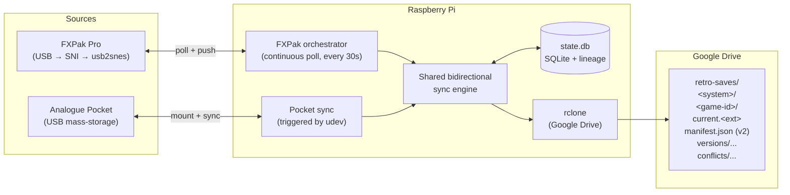

# Pocket Sync — Design Doc

**Status:** Draft for implementation
**Audience:** RetroSync v0.2 implementation agent (and future readers)
**Builds on:** [docs/design.pdf](design.pdf) — read that first if you haven't.

---

## TL;DR

Add Analogue Pocket as a second save source alongside the FXPak Pro,
with **bidirectional sync** through the existing Google Drive bucket.
When the Pocket is plugged into the Pi via USB-C in "Mount as USB Drive"
mode, the Pi:

1. Detects it via udev, mounts the SD card.
2. Uploads any Pocket saves the cloud doesn't already have at that hash.
3. Pushes any cloud saves that are newer than the Pocket's copy *for
   the same game*, including bootstrapping games the Pocket has never
   seen.
4. Records lineage + per-device sync state so divergent edits get
   flagged as conflicts (preserved, not silently overwritten).
5. Unmounts. The user pulls the cable.

The FXPak Pro flow grows the same bidirectional capability: on each
30-second poll, the daemon also pulls down any cloud saves newer than
the cart's copy and writes them back via `usb2snes PutFile`.

This document is the complete spec for that work — architecture, data
model changes, sync algorithm, conflict resolution, configuration,
migration, implementation plan, and tests.

## 1. Goals

- **Pocket plug-and-sync.** Plug Pocket → Pi (USB-C in mass-storage
  mode), wait a few seconds, unplug. No further action required.
- **One canonical save per game across devices.** A Super Metroid save
  made on FXPak Pro and a Super Metroid save made on the Pocket SNES
  core both land in the same `gdrive:retro-saves/snes/super_metroid/`
  tree and share version history.
- **Bidirectional sync.** Newer cloud → device, newer device → cloud,
  per-game, every sync.
- **Conflict-safe.** Two devices that diverged offline don't silently
  overwrite each other. We preserve both and require operator decision.
- **Bootstrap.** Plugging in a fresh Pocket should populate it with the
  current cloud saves for any game it has the ROM for, so you can pick
  up Chrono Trigger on the Deck after playing on the SNES.

## 2. Non-goals (this iteration)

- **Other Pocket cores** (NES, GG, Genesis, etc.). Foundation supports
  them — adding them later is just a config addition. Not in v0.2.
- **Pocket native cart save dumps** (`/Memories/Save Files/`). Different
  workflow, no FXPak counterpart, deferred.
- **Sync from / to the Mac.** Pi-only for now.
- **Wireless sync.** Pocket has no WiFi; not a real option.
- **Save-format translation between cores or systems.** We assume the
  Pocket SNES core's `.sav` is byte-equivalent to the FXPak Pro's `.srm`
  for the same game. (See §10 — verified empirically; format-translation
  hooks exist as future-proofing.)

## 3. Hardware and detection

The Analogue Pocket presents itself to the host OS as a removable
USB mass-storage device when the user enables **Tools → USB →
Mount as USB Drive** on the Pocket. From the Pi's perspective:

- A new `/dev/sdX` block device appears.
- It has a single FAT32 partition (`/dev/sdX1`).
- The partition is the Pocket's microSD card filesystem.
- When the Pocket is unmounted from the host (or the user dismounts
  from the Pocket UI), the device disappears.

**Detection strategy:** a udev rule matches the Analogue Pocket's
USB vendor:product (TBD by the implementing agent — see §13.1) and
triggers `retrosync-pocket-sync@<dev>.service`. The service:

1. Waits a moment for the device to settle.
2. Mounts `/dev/sdX1` at `/run/retrosync/pocket-mount/` (read-write).
3. Runs the one-shot Pocket sync (§7).
4. Unmounts cleanly via `umount` + `udisksctl power-off`.
5. Logs to journald so `journalctl -u 'retrosync-pocket-sync@*'` shows
   what happened.

We deliberately use a templated unit (`@<dev>.service`) so two Pockets
plugged in at once would each get their own sync run. (Unlikely, but
the cost is zero.)

## 4. Architecture



The novel piece is the **shared bidirectional sync engine** —
extracted from today's upload-only orchestrator. Both the FXPak loop
and the Pocket trigger funnel through it, so the conflict logic, the
lineage tracking, and the manifest schema only live in one place.

## 5. Data model changes

### 5.1 SQLite schema (state.db)

Add to `versions`:

```sql
ALTER TABLE versions ADD COLUMN parent_hash TEXT;
-- The hash this version replaced on its source device. Null for the
-- first-ever version of a save (no ancestor).
```

New table:

```sql
CREATE TABLE source_sync_state (
  source_id          TEXT NOT NULL,
  game_id            TEXT NOT NULL,
  last_synced_hash   TEXT NOT NULL,    -- the hash this source last
                                       -- agreed with the cloud on
  last_synced_at     TEXT NOT NULL,
  device_seen_path   TEXT,             -- where the save lives on the
                                       -- device (advisory; file paths
                                       -- vary by adapter)
  PRIMARY KEY (source_id, game_id)
);
```

`source_sync_state` is the per-device "last known good" pointer — the
hash both sides agreed on at the end of the most recent successful sync
for that game. It's the third corner of the triangle that lets us
distinguish "fast-forward" from "conflict" (see §7.3).

New table:

```sql
CREATE TABLE conflicts (
  id              INTEGER PRIMARY KEY AUTOINCREMENT,
  game_id         TEXT NOT NULL,
  system          TEXT NOT NULL,
  detected_at     TEXT NOT NULL,
  base_hash       TEXT,                -- common ancestor, if known
  candidate_a_id  INTEGER NOT NULL REFERENCES versions(id),
  candidate_b_id  INTEGER NOT NULL REFERENCES versions(id),
  resolved_at     TEXT,
  winner_hash     TEXT
);
```

### 5.2 Cloud manifest schema (v2)

Bump `schema` from 1 to 2. New top-level field `device_state`:

```json
{
  "schema": 2,
  "system": "snes",
  "game_id": "super_metroid",
  "save_filename": "Super Metroid (USA, Europe).srm",
  "current_hash": "8ad7d4173b1c5a89...",
  "updated_at": "2026-04-25T18:23:11Z",
  "device_state": {
    "fxpak-pro-1": {
      "last_synced_hash": "8ad7d4173b1c5a89...",
      "last_synced_at":   "2026-04-25T18:23:11Z"
    },
    "pocket-1": {
      "last_synced_hash": "addd1dcfb88e0144...",
      "last_synced_at":   "2026-04-25T17:55:02Z"
    }
  },
  "versions": [
    {
      "cloud_path":  ".../versions/2026-04-25T18-23-11Z--8ad7d417.srm",
      "hash":        "8ad7d4173b1c5a89...",
      "parent_hash": "addd1dcfb88e0144...",
      "size_bytes":  32768,
      "uploaded_by": "fxpak-pro-1",
      "uploaded_at": "2026-04-25T18:23:11Z",
      "retention":   "keep"
    }
  ],
  "conflicts": [
    {
      "id":              1,
      "detected_at":     "2026-04-26T09:14:22Z",
      "base_hash":       "abc12345...",
      "candidate_a":     {"hash": "...", "path": ".../conflicts/...", "from": "fxpak-pro-1"},
      "candidate_b":     {"hash": "...", "path": ".../conflicts/...", "from": "pocket-1"},
      "resolved_at":     null,
      "winner_hash":     null
    }
  ]
}
```

`uploaded_by` is new — lets us ask "did this version come from a
different device than the one we're now syncing with?" without
joining against state.db.

### 5.3 Cloud directory layout

Layout grows a `conflicts/` sibling to `versions/`:

```
gdrive:retro-saves/
└── snes/
    └── super_metroid/
        ├── current.srm
        ├── manifest.json
        ├── versions/
        │   └── 2026-04-25T18-23-11Z--8ad7d417.srm
        └── conflicts/
            └── 2026-04-26T09-14-22Z--cf55fc1a--from-pocket-1.srm
```

Files in `conflicts/` are immutable preserved-divergent copies, never
the live "current".

## 6. Game-ID alignment

The hardest design problem. Today FXPak Pro game IDs are
`<crc32>_<slug>` derived from the partner ROM. The Pocket has no
partner ROM access from the save adapter's perspective (we mount the
SD card; ROMs may be elsewhere on the same SD, but the save's
filename alone doesn't reliably point at one).

For the FXPak Pro and Pocket to share history, both need to resolve to
the **same game ID** for the same game.

**v0.2 strategy: canonical slug + alias map.**

- Drop the `<crc32>_` prefix from game IDs. New format is just `<slug>`.
- Slug derivation is normalized so common dump-naming variants collapse:
  - Lowercase, replace non-alphanumerics with `_`, collapse runs.
  - Strip common region/revision tags after the rest of the name:
    `(usa)`, `(europe)`, `(en,ja)`, `(j)`, `(u)`, `[!]`, `(v1.1)`,
    `(virtual_console_...)`, etc. (List driven by config; default
    list covers No-Intro / GoodSNES conventions.)
  - Strip leading/trailing `_`.
  - Examples:
    - `Super Metroid (USA, Europe) (En,Ja).srm`  → `super_metroid`
    - `Chrono Trigger (U) [!].srm`              → `chrono_trigger`
    - `A Link to the Past.srm`                  → `a_link_to_the_past`
    - Pocket's `Super Metroid.sav`              → `super_metroid`
  - This isn't perfect — different games sometimes have the same name
    (e.g. NES vs. SNES "Battletoads"). System namespacing (`snes/...`)
    handles cross-system collisions.
- For collisions within a system, the operator overrides via
  `config.yaml`:

  ```yaml
  game_aliases:
    # Make these all resolve to the same game_id even though their
    # save filenames differ.
    super_metroid:
      - "super_metroid_usa_europe_en_ja_virtual_console_classic_mini_switch_online"
      - "super_metroid"
      - "super_metroid_jpn"
  ```

  The alias map is checked AFTER slug normalization. Each adapter's
  raw slug is looked up; if it appears in any alias list, the canonical
  ID is the alias group's name.

- The CRC32 still gets stored in `manifest.json` for forensics
  (`versions[].rom_crc32` if known), but it doesn't gate identity.

This change is the right time to also clean up the FXPak Pro's
existing `unknown_<slug>` mess in cloud — see §11.

## 7. Sync algorithm

The same engine drives both the per-poll FXPak path and the per-plug-in
Pocket path. Inputs per (source, game):

- `H_dev` — current save hash on the device.
- `H_cloud` — cloud's current hash (`manifest.current_hash`).
- `H_last` — `source_sync_state[(source, game)].last_synced_hash`,
  null if this device has never synced this game.
- `H_dev_parent` — what the device's last save replaced. For FXPak
  this is the previous hash we observed on the cart (already tracked).
  For Pocket, it's null on first plug-in for a given game; otherwise
  it's the previous Pocket-side hash from `source_sync_state`.

### 7.1 Decision matrix

| Condition | Interpretation | Action |
|---|---|---|
| `H_dev == H_cloud` | Already in sync. | Update `source_sync_state.last_synced_hash = H_dev`. No upload, no download. |
| `H_cloud is null` (no cloud version yet for this game) | Bootstrap from device. | Upload `H_dev`. Update sync state. |
| `H_last is null AND H_cloud != null` (device has save, cloud has different save, no prior agreement) | Pocket has never synced this game and cloud already has data. Could be: device is fresh & needs bootstrap; or device has been played offline and we never synced. We can't tell — treat as conflict (don't overwrite anything). | Upload `H_dev` to `conflicts/`. Insert `conflicts` row. **Don't write to device.** Operator resolves. |
| `H_last == H_cloud AND H_dev != H_cloud` | Cloud unchanged since last sync; device advanced. Fast-forward upload. | Upload `H_dev`. Update sync state. |
| `H_last == H_dev AND H_cloud != H_dev` | Device unchanged since last sync; cloud advanced. Fast-forward download. | Pull `H_cloud` to device. Update sync state. |
| `H_last != H_cloud AND H_last != H_dev` | Both moved since last sync. Divergence. | Upload `H_dev` to `conflicts/`. Insert `conflicts` row. **Don't write to device.** Operator resolves. |
| Game in cloud but **not on device** AND device has the ROM (or we don't know) | Bootstrap-pull. | Pull `H_cloud` to device. Update sync state. |

### 7.2 Bootstrap-pull caveat

The "device doesn't have a save for this game yet" case for Pocket is
common: the user has 50 ROMs on Pocket but only 5 saves. We want
plugging in to populate any missing saves where there's a cloud
version.

For each game in cloud:

- If the Pocket's `Saves/<core>/<game>.sav` doesn't exist:
  - Check if any `Saves/<core>/<game>*.sav` exists (covers stem
    fuzziness — for now, exact-match only).
  - If still missing: write `cloud.current.srm` to
    `Saves/<core>/<canonical-filename>.sav`. Canonical filename comes
    from a per-game `pocket_filename` field in the alias config; if
    unset, use the `<slug>.sav`. Print a warning suggesting the user
    confirm the filename matches the ROM.
- This means missing-on-device is **not a conflict** — it's a clean
  pull. Only an existing-on-device-with-different-hash without prior
  agreement triggers conflict.

### 7.3 Conflict handling

When the algorithm determines conflict:

1. Upload the device's current bytes to
   `conflicts/<ts>--<hash8>--from-<source-id>.<ext>`. (Cloud's current
   stays put — it's already in `versions/`.)
2. Insert a `conflicts` row in state.db with `candidate_a_id` =
   cloud's current version's id, `candidate_b_id` = the new
   conflict-side version's id, `base_hash` = `H_last` (may be null).
3. Append to `manifest.conflicts[]`.
4. Log a loud WARNING and emit a notification (see §9).
5. Skip writing back to the device. Sync proceeds for other games.

Resolution via CLI:

```bash
retrosync conflicts list
retrosync conflicts show <id>
retrosync conflicts resolve <id> --winner <hash>
retrosync conflicts resolve <id> --winner cloud      # alias for cloud's current
retrosync conflicts resolve <id> --winner device     # alias for the conflict candidate
```

`resolve` makes the chosen hash the new `current`, marks the conflict
resolved in both DB and manifest, and clears the `device_state` for
all sources back to that winner so the next sync converges.

## 8. Components

### 8.1 New / changed files

```
retrosync/
├── sources/
│   ├── pocket.py           NEW — PocketSource adapter
│   ├── fxpak.py            CHANGED — emit parent_hash; fix unknown_*
│   └── ...
├── sync.py                 NEW — extracted bidirectional engine
├── orchestrator.py         CHANGED — call sync.py instead of inlined upload
├── conflicts.py            NEW — conflict storage + resolve helpers
├── game_id.py              NEW — slug normalization + alias resolution
├── state.py                CHANGED — new tables, parent_hash column, migrations
├── cloud.py                CHANGED — manifest v2, device_state, conflicts/
├── cli.py                  CHANGED — new conflicts subcommand group, pocket-sync subcommand
└── pocket/
    ├── __init__.py
    ├── detect.py           NEW — udev integration helper, used by setup.sh and CLI
    └── sync_runner.py      NEW — invoked by the systemd unit
install/
├── systemd/
│   ├── retrosync-pocket-sync@.service     NEW — templated, triggered by udev
│   └── ...
└── udev/
    └── 99-retrosync-pocket.rules          NEW — installed under /etc/udev/rules.d/
docs/
├── design.pdf
└── pocket-sync-design.md   THIS FILE
```

### 8.2 PocketSource adapter

```python
class PocketSource(SaveSource):
    """Mounts the Pocket's SD card and reads/writes save files in
    Saves/<core>/."""

    system = "snes"  # for now; "all" handled by future PocketAllSource

    def __init__(self, *, id: str, mount_path: str, core: str,
                 file_extension: str = ".sav"):
        self.id = id
        self._mount_path = Path(mount_path)
        self._core = core             # e.g. "agg23.SNES"
        self._ext = file_extension

    async def health(self) -> HealthStatus:
        saves_dir = self._mount_path / "Saves" / self._core
        if not saves_dir.is_dir():
            return HealthStatus(False, f"{saves_dir} not mounted/missing")
        return HealthStatus(True, f"mounted at {self._mount_path}")

    async def list_saves(self) -> list[SaveRef]: ...
    async def read_save(self, ref: SaveRef) -> bytes: ...
    async def write_save(self, ref: SaveRef, data: bytes) -> None:
        # Atomic-ish: write to .tmp, fsync, rename.
        ...
    def resolve_game_id(self, ref: SaveRef) -> str:
        # Use game_id.canonical_slug() over ref.path stem.
        ...
```

### 8.3 sync.py (the engine)

Pseudocode:

```python
async def sync_one_game(source, game_id, *, state, cloud, manifest):
    H_dev = await source.read_save_hash(...)         # may be None
    H_cloud = manifest.current_hash                  # may be None
    H_last = state.last_synced(source.id, game_id)   # may be None

    if H_dev == H_cloud:
        state.update_synced(source.id, game_id, H_dev)
        return SyncResult.IN_SYNC

    if H_cloud is None:
        await upload(source, game_id, H_dev, parent_hash=None)
        state.update_synced(...); return SyncResult.UPLOADED

    if H_dev is None:
        # Bootstrap-pull
        await pull_to_device(source, game_id, H_cloud, manifest)
        state.update_synced(...); return SyncResult.DOWNLOADED

    if H_last is None:
        # Conflict — see §7.1 row 3
        await record_conflict(source, game_id, H_dev, H_cloud, base=None)
        return SyncResult.CONFLICT

    if H_last == H_cloud:                # cloud unchanged → upload
        await upload(source, game_id, H_dev, parent_hash=H_cloud)
        state.update_synced(...); return SyncResult.UPLOADED

    if H_last == H_dev:                  # device unchanged → download
        await pull_to_device(source, game_id, H_cloud, manifest)
        state.update_synced(...); return SyncResult.DOWNLOADED

    # Both moved
    await record_conflict(source, game_id, H_dev, H_cloud, base=H_last)
    return SyncResult.CONFLICT
```

The orchestrator (continuous FXPak loop) calls `sync_one_game` for
every save the cart reports each pass. The Pocket trigger calls
`sync_one_game` for every save AND every cloud-only game (for
bootstrap-pull). Both also pace rclone calls per the §12 plan.

### 8.4 Pocket trigger

systemd template unit:

```ini
[Unit]
Description=RetroSync — Pocket sync (%i)
After=systemd-udevd.service

[Service]
Type=oneshot
ExecStart=/usr/local/bin/retrosync pocket-sync --device /dev/%i
TimeoutStartSec=300
StandardOutput=journal
StandardError=journal
```

udev rule (e.g. `99-retrosync-pocket.rules`):

```
ACTION=="add", SUBSYSTEM=="block", \
  ATTRS{idVendor}=="XXXX", ATTRS{idProduct}=="YYYY", \
  ENV{SYSTEMD_WANTS}="retrosync-pocket-sync@%k.service"
```

`XXXX:YYYY` is determined empirically — the agent runs `lsusb -v`
with the Pocket plugged in and pastes the IDs.

The CLI subcommand `retrosync pocket-sync --device /dev/sda1` does:

1. Mount `/dev/sda1` at `/run/retrosync/pocket-mount/`.
2. Build a `PocketSource` pointed at the mount.
3. Run `sync.run_all(sources=[pocket_source], one_shot=True)`.
4. Unmount, power-off via `udisksctl`, exit cleanly.

## 9. Operator experience

### 9.1 Logs

`journalctl -u retrosync` shows the FXPak loop activity (unchanged).
`journalctl -u 'retrosync-pocket-sync@*'` shows each Pocket sync run:

```
Pocket detected at /dev/sda1, mounting...
Found 8 save files in /Saves/agg23.SNES/
  super_metroid.sav  → cloud has older version, pulling new bytes (...)
  chrono_trigger.sav → device has newer version, uploading
  link_to_the_past.sav → IN SYNC
  metroid_zero.sav   → no cloud version, bootstrap upload
  ...
2 uploads, 1 download, 5 in-sync, 0 conflicts
Unmounting...  done.
```

### 9.2 CLI

New CLI commands:

```
retrosync pocket-sync --device <dev>      # invoked by udev or manually
retrosync conflicts list
retrosync conflicts show <id>
retrosync conflicts resolve <id> --winner {cloud | device | <hash>}
retrosync sync-status [--source <id>]     # last-sync summary per source per game
```

`retrosync status` grows a `conflicts: <n> open` line.

### 9.3 Notifications

Pluggable, off-by-default for v0.2. Stub interface in
`retrosync/notify.py`. Operators can configure a Pushover or
Discord-webhook notifier in `config.yaml`:

```yaml
notify:
  on_conflict: pushover
  on_pocket_sync: pushover
  pushover:
    user_key: ...
    app_token: ...
```

## 10. Save-format compatibility

**Assumption to verify before shipping:** the openFPGA SNES core's
`<game>.sav` is byte-equivalent to the FXPak Pro's `<game>.srm` for
the same game state. Both are raw SRAM dumps; both should be
8 KB / 32 KB / 64 KB depending on the cart's SRAM size. The Pocket
core may pad differently (e.g. always 128 KB).

**Verification step (mandatory before flipping bidirectional sync on):**

1. Save in the same game on the FXPak Pro. Note hash via
   `retrosync show fxpak-pro-1 /sd2snes/saves/<game>.srm`.
2. Pull `current.srm` from cloud, copy to Pocket's
   `/Saves/agg23.SNES/<game>.sav`.
3. Boot game on Pocket. Confirm save loads correctly.
4. Save on Pocket. Pull file off, byte-compare to step-1 file
   (after stripping trailing zero padding to the smaller size).

If they're equivalent: ship.

If they differ: introduce a per-(system, source) translation hook in
the engine. `PocketSource.read_save()` and `write_save()` get a chance
to canonicalize bytes. For SNES specifically, the most likely
translation is "trim/pad to FXPak's expected SRAM size."

## 11. Migration

The existing cloud has folders named `unknown_<slug>` and (after the
in-flight CRC fix) `<crc32>_<slug>`. The new format is just `<slug>`.

`retrosync migrate-paths` (one-shot CLI):

1. Lists everything under `<remote>/snes/`.
2. For each folder, computes the target slug by stripping any leading
   hex prefix and re-normalizing.
3. If the target folder exists already, merges the manifest and
   versions (taking the union; superseded entries become conflicts).
4. Otherwise, renames in-place via `rclone moveto`.
5. Updates state.db `files.game_id` to match.

After migration, `current_hash` and the per-source `last_synced_hash`
in the merged manifest are taken from the most-recent uploaded
version — the operator should expect the next FXPak poll to re-confirm
those.

## 12. Rate-limit + correctness

The 0.5s inter-upload sleep stays in the engine. New work to limit:

- A bootstrap-pull on first Pocket plug-in could hit dozens of games at
  once. Apply the same pacing for downloads.
- `lsjson` calls during conflict detection accumulate fast. Cache
  per-game manifests in memory for the duration of a sync run; only
  re-read on cache miss.

## 13. Implementation plan (handoff to agent)

Steps in order. Each step is independently mergeable and reviewable.
Where applicable, "test" means add a corresponding case to
`tests/dry_run.py` that proves the change works against the mock
source + fake rclone harness.

### Step 1 — Game-ID normalization
- Add `retrosync/game_id.py` with `canonical_slug(name) -> str`.
- Add config field `game_aliases: dict[str, list[str]]`.
- Update FXPak adapter's `resolve_game_id` to use canonical_slug only
  (drop the `<crc32>_` prefix).
- Don't touch existing cloud yet — that's Step 8.
- **Test:** unit tests for slug normalization across the No-Intro
  patterns and FXPak's existing 5 saves.

### Step 2 — State store schema migration
- Add `parent_hash` column to `versions`.
- Add `source_sync_state` table.
- Add `conflicts` table.
- Migration runs on daemon start: `ALTER TABLE` + `CREATE TABLE IF NOT
  EXISTS`. SQLite handles this cleanly.
- Update `state.insert_pending()` to accept and persist `parent_hash`.
- **Test:** dry-run keeps passing; verify `parent_hash` populated for
  the second+ version in the change-detection test.

### Step 3 — Manifest v2
- Update `cloud.Manifest` to schema 2: `device_state`, `conflicts`,
  versions get `parent_hash` + `uploaded_by`.
- Add reader-side compat for v1 manifests (treat missing fields as
  empty) so we can still read existing cloud data.
- **Test:** manifest round-trip, old-manifest read.

### Step 4 — Extract sync engine
- Create `retrosync/sync.py` with `sync_one_game()` per §8.3.
- Refactor `orchestrator._upload_version` and the surrounding
  `_drain_ready` into calls to `sync_one_game`.
- For now, every code path goes through the upload-only branches —
  no behavior change yet.
- **Test:** dry-run still passes end-to-end.

### Step 5 — Bidirectional FXPak path
- Wire `sync_one_game`'s download case for FXPak. The PutFile path
  exists in `usb2snes.py`; the FXPak adapter just needs `write_save`
  exposed (already there).
- Update orchestrator to feed the engine all known-cloud games, not
  just present-on-cart, so cloud-newer fast-forwards write to cart.
- Gate this behind a config flag `cloud_to_device: false` initially
  for safety; default true in Step 9 once tests pass.
- **Test:** dry-run case where cloud is ahead of cart → cart gets
  written.

### Step 6 — Conflict storage + manifest writes
- `retrosync/conflicts.py`: insert/list/resolve helpers.
- Engine writes to `conflicts/` and emits manifest entries on the
  conflict path.
- `retrosync conflicts list/show/resolve` CLI subcommands.
- **Test:** dry-run case where both cloud and device moved since last
  sync → conflict row appears, both files preserved, neither device
  written, CLI surfaces the conflict and resolves it.

### Step 7 — PocketSource adapter
- `retrosync/sources/pocket.py` per §8.2.
- Register `pocket` in the lazy adapter registry.
- `retrosync test-cart pocket-1` works against a mounted Pocket image
  (tests/fixtures/pocket-mock-fs.tar.gz can stand in).
- **Test:** dry-run extends with a PocketSource pointed at an
  in-memory fixture; same assertions as FXPak.

### Step 8 — udev + systemd plumbing
- Determine vendor:product ID empirically (have the agent run
  `lsusb -v` on the Pi with Pocket plugged in and grep for "Analogue").
- Create `install/udev/99-retrosync-pocket.rules`.
- Create `install/systemd/retrosync-pocket-sync@.service`.
- Update `setup.sh` to install both files and run `udevadm control
  --reload` + `udevadm trigger`.
- Add `/usr/local/bin/retrosync pocket-sync` subcommand that does the
  mount → sync → unmount dance per §8.4.
- **Test:** plug in Pocket, see service fire, verify
  journalctl output. (Manual test on real hardware only.)

### Step 9 — `retrosync migrate-paths`
- One-shot subcommand per §11.
- Idempotent: re-running on already-migrated tree is a no-op.
- Run on the existing Pi to clean up `unknown_*/` cruft.
- **Test:** pre-populate the fake_rclone tree with `unknown_super_metroid/`,
  run migrate, confirm result is `super_metroid/` with merged versions.

### Step 10 — Documentation + verification
- Update `README.md` with Pocket setup section (link to this doc).
- Update `docs/design.pdf`'s Appendix A (or fold the bidirectional
  story into the main design — your call).
- Run the §10 save-format compatibility check on the user's hardware
  before flipping `cloud_to_device: true` as the default.

## 14. Open questions

- **Pocket SNES core save filenames.** The user's setup uses one
  specific core. The agent should `ls /Saves/<core>/` on first
  connection and capture the filename convention. Build the alias map
  from that real data, not guesses.
- **What happens if the Pocket is unplugged mid-write?** The atomic
  write-via-temp + rename pattern protects us. After-the-fact: if a
  write was in flight when the cable came out, the cloud copy is
  already stable, the device is in its prior state, and the next
  plug-in re-runs the case from scratch. Worst case: we mark a
  cloud-side state-store entry that doesn't reflect what's on the
  device, which fixes itself on next sync.
- **Multiple Pockets.** Out of scope for v0.2 but the schema supports
  it (each Pocket gets its own `source_id` like `pocket-1`,
  `pocket-2`).
- **Ambiguous game-ID matches.** If a slug normalizes to the same
  string for two different games (e.g. NES Battletoads vs. SNES
  Battletoads — handled by system namespacing — but consider
  `metroid` for both NES and SNES Metroid: cleanly disambiguated by
  `system`). The unhandled case is two different SNES games with
  identical canonical slugs — vanishingly rare, but the alias map is
  the escape hatch.

## 15. Out of scope but interesting

- Web UI for browsing the version history and resolving conflicts
  visually instead of by hash.
- Per-game retention overrides (already in the v1 design's roadmap as
  M4).
- "Pocket Sync Mode" hotkey on the Pocket itself that auto-enables
  USB drive mode. Not something we control — Analogue's UI choice.
- A Mac-side companion that does the same sync when you plug the
  Pocket into the Mac. Same engine, different transport.

---

## 16. Addendum: post-implementation refinements

Sections 1–15 describe the design as drafted. Sections 16+ document
**what actually shipped** after implementing against real hardware
(two physical Analogue Pockets + an FXPak Pro) and discovering edge
cases the design didn't anticipate. Wherever this addendum contradicts
an earlier section, the addendum is correct for the current code.

The implementation lives on commits beyond §13's Step 10 ("Documentation
+ verification"). Rough chronology: ~17 PRs covering empirical
hardware discoveries, configurability the design assumed wouldn't
matter, and one entire mechanism (the drift filter, §16.6) the design
didn't anticipate at all.

### 16.1. Pocket SD layout — empirical findings

The design (§3) assumed FAT32. **The Pocket actually ships exFAT**
on stock setups with >32 GB SDs (the FAT32 filesystem-size limit).
Linux ≥5.4 mounts exFAT natively via the `exfat` kernel driver, so
no extra packages are required, but two places needed the `vfat`
assumption removed:

- `mount_pocket()` no longer passes `-t vfat`; the kernel auto-detects.
- The udev rule matches `ENV{ID_FS_TYPE}=="vfat|exfat"`.

The design also assumed SNES saves live at `/Saves/agg23.SNES/`.
**Empirically the openFPGA SNES core writes to `Saves/snes/common/`**
(shared across SNES cores). `PocketConfig.core` defaults to
`snes/common`; operators with a non-standard core can override.

The Pocket's USB IDs (`04d8:ca19`) are baked into the udev rule —
no `lsusb` step required for default installs.

macOS leaves `._<filename>` AppleDouble metadata sidecars on SDs
that have been mounted on a Mac. `PocketSource.list_saves` skips
them (otherwise they'd be processed as additional saves).

### 16.2. Per-physical-device source IDs (auto-derived from SD UUID)

The design (§14) noted "Multiple Pockets out of scope for v0.2 but the
schema supports it (each Pocket gets its own source_id like pocket-1,
pocket-2)". Multi-Pocket support proved **necessary**, not optional —
running two physical Pockets through the same hardcoded `pocket-1`
source_id silently corrupted `source_sync_state` (the row got
overwritten by whichever Pocket synced last, leading to stale-bytes
re-uploads on the next plug-in of the *other* Pocket).

Fix: at sync time, the runner blkids the mounted partition and
derives `source_id = pocket-<UUID>` (e.g. `pocket-6434-3362`). Each
physical Pocket gets a stable, distinct identity. Operators with a
configured `pocket` source in `config.yaml` can still pin a friendly
name; auto-derivation is the fallback.

Helpers live in `retrosync.pocket.sync_runner`:

- `read_device_uuid(device)` — blkid wrapper.
- `derive_source_id_for_device(device, fallback)` — returns
  `pocket-<UUID>` or the fallback if blkid is unavailable.

`load._pocket_source_id` uses the same logic so manual `retrosync load
<game> pocket` invocations also write per-device sync state.

### 16.3. Cloud layout — per-device-kind version subfolders

`SaveSource` gained a `device_kind` attribute used purely for
human-readable cloud organization:

- `FXPakSource.device_kind = "snes"`
- `PocketSource.device_kind = "pocket"`

Versions and conflicts now land under a per-device subfolder:

```
gdrive:retro-saves/
└── snes/
    └── super_metroid/
        ├── current.srm
        ├── manifest.json
        ├── versions/
        │   ├── snes/
        │   │   └── 2026-...--abc.srm    (FXPak upload)
        │   └── pocket/
        │       └── 2026-...--def.srm    (Pocket upload)
        └── conflicts/
            └── pocket/
                └── 2026-...--from-pocket-6434-3362.srm
```

The engine resolves saves by **hash**, not by path — layout is purely
cosmetic. Existing files at the unprefixed `versions/<file>` path
(from before this change) still work; `conflicts._find_paths_by_hash`
recurses one level so old + new layouts both resolve.

### 16.4. System-canonical extension (`current.srm` cross-adapter)

The design's path scheme used the source's own file extension
(e.g. FXPak's `.srm`, Pocket's `.sav`). That meant FXPak and Pocket
ended up writing to *different* `current.<ext>` filenames for the
same game, breaking cross-source resolution.

Fix: `cloud.SYSTEM_CANONICAL_EXTENSION = {"snes": ".srm"}`. Cloud's
`current.<ext>` is system-canonical, not source-canonical. Both FXPak
and Pocket SNES writes land at `…/super_metroid/current.srm`. The
versions directory still preserves whichever extension was originally
uploaded (so the version files are self-describing), but `current.<ext>`
is consistent.

### 16.5. Conflict resolution — `conflict_winner: device` is the default

The design (§7.1, §7.3) called for "preserve both, require operator
decision" on every divergence. The shipped default is **device-wins
auto-resolve**:

- **`conflict_winner: device`** (new default) — device's bytes become
  the new `current.<ext>` and a new versions/* entry. The previous
  cloud bytes stay in `versions/<previous-hash>.<ext>` (where they
  already lived, so nothing's destroyed). A `conflicts` row is
  inserted but pre-marked `resolved` for forensic visibility via
  `retrosync conflicts list --all` / `... show <id>`. **Only the
  resolving device's `sync_state` is updated** — other devices keep
  their pointers to avoid ping-pong on the next sync.
- **`conflict_winner: preserve`** — the original §7.3 behavior. Park
  device bytes in `conflicts/`, leave cloud's current alone, require
  manual `retrosync conflicts resolve`.

The design's safety property ("don't silently overwrite") is
preserved either way: the loser's bytes are always preserved in
`versions/<loser-hash>.<ext>`. The change is in *who has to act* —
the operator opts into preserve mode if they want to inspect every
divergence.

### 16.6. Drift filter — accommodating SRAM counter ticks

**Entirely new mechanism not in the original design.**

The Pocket's openFPGA cores tick in-game counters in SRAM even when
the operator isn't actively playing — single-byte differences appear
across plug-ins (e.g. FF3 byte at offset 8178 increments by 1 each
USB Drive cycle). The design's hash-based comparison treats every
byte change as "device advanced" → upload, producing a fresh cloud
version on every plug-in. Annoying clutter that obscures genuine
saves in the version history.

`SyncConfig.drift_threshold: dict[device_kind, int]` (default empty
= no filtering). When a fast-forward upload is about to fire AND the
device's bytes differ from the appropriate reference by ≤ threshold
bytes, the engine treats as in-sync rather than uploading.

**Reference for comparison: `h_last`'s bytes**, fetched from cloud's
`versions/...` via the manifest. (The design's case 5 has
`h_last == h_cloud` so cloud's current works too; case 7 doesn't, so
we always go via the manifest for consistency.)

Coverage matrix — drift relevance per case from §7.1:

| Case | Description | Drift relevant? |
|------|-------------|-----------------|
| 1 | `h_dev == h_cloud` (in sync) | No — exact match |
| 2 | `h_cloud is None` (bootstrap upload) | No — nothing to compare |
| 3 | `h_dev is None` (bootstrap pull) | No — no device bytes |
| 4 | `h_last is None`, cloud disagrees | **Yes** — see §16.7 |
| 5 | `h_last == h_cloud != h_dev` | **Yes** — drift → IN_SYNC |
| 6 | `h_last == h_dev != h_cloud` | No — device unchanged |
| 7 | Both moved | **Yes** — drift → treat as case 6 |

Cost: bounded — case 5/7 each do one cloud download per drift event.
Case 4's drift scan iterates up to `max_check=5` historical versions
(see §16.7), worst-case 5 cloud cats on a brand-new genuinely-new
device. The common in-sync path remains zero cloud calls.

Suggested operator value:

```yaml
drift_threshold:
  pocket: 4
```

Trade-off: real saves smaller than the threshold also get filtered.
4 bytes is empirically generous enough for SRAM ticks but small
enough to catch a real save's first HP/MP/inventory delta.

### 16.7. Case 4 (no-prior-agreement) — stale-device detection

The design's case 4 ("device has save, cloud has different save, no
prior agreement") routed straight to conflict. With
`conflict_winner=device` that becomes "auto-upload device's bytes",
which is wrong when the device's bytes are *stale* — e.g. after the
per-UUID migration in §16.2 created a fresh source_id for a Pocket
whose actual save data hadn't changed.

Three checks now run before falling through to divergence handling:

1. **Exact-hash match against history.** `state.hash_in_versions_for_game(game_id, h_dev)` — if h_dev was ever uploaded under any source for this game, the device is presenting a known stale version. Pull cloud's current (case 6 semantics).
2. **Drift match against recent history.** `_is_drift_from_any_known()` — if h_dev's bytes are within `drift_threshold` of any of the last `max_check` (default 5) historical versions, treat the device as stale and pull cloud's current.
3. **`cloud_wins_on_unknown_device` policy** (opt-in). When set, a truly-novel device with no prior history *and* the manifest has at least one version (i.e. someone has been syncing this game) → preserve the device's bytes as a `versions/*` entry but don't make them current. Cloud's current wins; with `cloud_to_device: true`, cloud's bytes are written to the device. Recovers from the per-UUID-migration scenario when the device's bytes don't match anything in history exactly.

Only after all three checks fail does case 4 proceed to
`_handle_divergence` (the original conflict path).

### 16.8. ROM-aware save filename derivation

The design assumed Pocket saves were either bootstrap-pulled to a
slug-named file (`<slug>.sav`) or written to an existing matching
file. **The Pocket loads saves by ROM-stem matching** — slug-named
files aren't picked up. Code now does a three-tier lookup:

`PocketSource.target_save_path_for(game_id)`:

1. **Existing matching save on the device** (`existing_save_for`):
   walk `Saves/<core>/`, find files whose canonical slug matches
   `game_id`. When multiple exist (e.g. ROM-decorated original + a
   slug-named leftover from an earlier load), prefer the
   ROM-decorated one — that's the file the Pocket actually loads.
2. **Matching ROM in `Assets/<core>/`** (`find_rom_for`): scan ROMs
   matching `rom_extensions` (default `.smc`/`.sfc`), filter by slug,
   pick by `region_preference` (default `["usa", "world", "europe",
   "japan"]`). Use the ROM's stem + save extension as the new save
   filename.
3. **Slug fallback** (`canonical_save_path`): only path the Pocket
   can't load. Caller (`load`, `bootstrap-pull`) emits a WARNING
   telling the operator to drop the ROM in or rename the file.

`list_saves` also dedupes: when multiple files map to the same
canonical slug, the ROM-decorated name wins; others are logged at
WARNING level so the operator can clean them up. Without this,
each plug-in would produce a separate cloud version per duplicate
file.

### 16.9. CLI additions

Beyond what §9.2 lists, three new commands:

```bash
retrosync load <game_id> <target>   # cloud current → device by friendly name
                                    # target=pocket | snes | <system>
                                    # `pocket` requires sudo (mount step)
retrosync versions <game_id>        # cross-source version history with provenance
retrosync versions <game_id> --from <source_id>
retrosync migrate-paths             # one-shot legacy <crc32>_*/unknown_* collapse
```

`load <game> pocket` is the manual override for the udev path. It:

- Auto-detects the Pocket via `/dev/disk/by-id/usb-*Pocket*-part1`.
- Sets a skip-flag at `/run/retrosync/skip-auto-sync` so the
  udev-fired sync unit exits early (avoiding mount-race).
- Waits up to 90s for the operator to plug in + enable USB Drive mode.
- Mounts, writes via `target_save_path_for`, unmounts, clears the flag.

The wrapper at `/usr/local/bin/retrosync` recognizes
`pocket-sync` and `load <game> pocket` as needing root and stays
root if invoked via `sudo retrosync ...` (otherwise it auto-elevates
to the unprivileged `retrosync` user, who can't mount).

### 16.10. Cross-source manifest writes

The design's `refresh_manifest` (§5.2 / §8.3) was implemented as
per-source initially, querying `state.list_versions(source_id, path)`.
That meant each cross-source sync overwrote the manifest with only
the running source's slice of versions — losing other devices'
version history every time a different device synced.

Fix: `refresh_manifest` now joins `versions` to `files` on `game_id`
across **all sources**, so the manifest is a true cross-source
record. `manifest.versions[].uploaded_by` correctly reflects the
authoring source of each entry.

### 16.11. Transient cloud errors don't get mistaken for "missing"

The design assumed `cloud.exists()` returned True or False. The
shipped code distinguishes "definitely missing" from "couldn't tell"
via rclone's exit codes:

- `0` (with non-empty output) → exists.
- `0` (with empty output) → doesn't exist.
- `3` (directory not found), `4` (file not found) → doesn't exist.
- Anything else (rate-limit, network blip, auth glitch) → raises
  `CloudError`.

`SyncContext.manifest_for()` propagates `CloudError`; `sync_one_game`
catches it, logs WARNING, returns `SyncResult.SKIPPED`. Crucial:
without this, a transient Drive 429 makes the engine think the
manifest doesn't exist → bootstrap upload (case 2) → fresh cloud
version of an unchanged save. The bug surfaced as `clock_tower`
having three identical-hash version entries despite never being
touched on the cart.

### 16.12. Conflicts resolver — hash-fallback for stale paths

`conflicts.resolve` originally trusted the conflict row's stored
`cloud_path`. After `migrate-paths` collapses a legacy
`unknown_<...>` folder, that path no longer exists; resolves crashed
with "directory not found".

Fix: try the stored path first, then fall back to scanning the
canonical game folder's `versions/` and `conflicts/` subdirs (and
their device-kind subfolders, per §16.3) for any file whose name
encodes the winner's `hash8`. The full hash is verified after
download.

`migrate-paths` was also updated to rewrite `cloud_path` columns in
`versions`, `conflicts.cloud_path`, and `conflicts.conflict_path`,
so future state.db reads land at the new paths directly.

### 16.13. Operational surfaces — sudoers, ownership, file-system races

A handful of installer-side fixes that don't change the design but
matter for a working deploy:

- **`upgrade.sh` no longer uses `sudo -E`** — strict sudoers policies
  (default on stock Raspberry Pi OS) reject "preserve the
  environment". Plain `sudo "$0" "$@"` works everywhere.
- **`setup.sh` `rm -f /usr/local/bin/retrosync` before `cat >`** —
  legacy installs left that path as a symlink to the venv-side
  trampoline, so writing the wrapper there clobbered the trampoline
  with the wrapper (causing infinite `exec` recursion).
- **`setup.sh` defensively chowns `rclone.conf` + `state.db` to the
  retrosync user** — root-owned files in `/var/lib/retrosync` from
  earlier sudo operations silently broke the daemon and CLI.
- **`retrosync-pocket-sync@.service`** sets
  `RuntimeDirectoryPreserve=yes` — without it, systemd cleans up
  `/run/retrosync` the moment the unit exits (Type=oneshot), racing
  any in-flight `retrosync load <game> pocket` whose mount point
  is also under `/run/retrosync`.
- **`mount_pocket()` re-mkdirs the mount path right before the mount
  syscall** — belt-and-suspenders against the same class of race.

### 16.14. Custom Google OAuth client for higher API quota

Optional but recommended for active multi-device setups. Documented
inline in the Pi setup walkthrough; not a code change. Summary:
rclone's shared default OAuth client splits Drive's per-minute
quota across every rclone user globally; a custom Desktop OAuth
client (15-min GCP setup) gets ~1B requests/day per project. After
switching, change `scope = drive.file` to `scope = drive` in
`rclone.conf` so the new client can see folders created by the old
client (drive.file is per-app-scoped, drive isn't).

### 16.15. Configuration reference (current state)

Top-level keys in `/etc/retrosync/config.yaml` introduced in this
implementation but not in §13:

```yaml
# Bidirectional sync — daemon writes cloud-newer saves back to the
# device. Default false until the operator has verified byte-format
# round-tripping (§10).
cloud_to_device: true

# Divergence behavior — see §16.5.
conflict_winner: device     # | preserve

# §16.7 opt-in for multi-device migrations.
cloud_wins_on_unknown_device: true

# §16.6 drift filter, per device_kind.
drift_threshold:
  pocket: 4

# Manual game-id override map (see §6).
game_aliases: {}
```

Per-`pocket` source options:

```yaml
sources:
  - id: pocket-1            # auto-derived from SD UUID if omitted
    adapter: pocket
    options:
      core: snes/common     # path under Saves/ — empirically right for agg23.SNES
      file_extension: .sav
      rom_extensions: [.smc, .sfc]
      assets_subpath: ""    # default: mirror `core` under Assets/
      region_preference: [usa, world, europe, japan]   # §16.8
```

### 16.16. FXPak instant-sync (poke + fast unhealthy recheck)

The design's 30s poll loop (§4) means cart-on → first sync latency
is up to 30s — long enough that an operator who plugs in and
launches a ROM might miss a cloud-newer save. Two layers of
mitigation, both shipped:

1. **Fast unhealthy recheck** (`OrchestratorConfig.unhealthy_recheck_sec`,
   default 2). When `source.health()` reports unhealthy (cart off /
   SNI unreachable), the inter-pass wait drops from 30s to this
   value. So cart-off → cart-on transitions are noticed within ~2s
   without any extra plumbing. Health-check log spam during the
   off period is suppressed (only the "went unhealthy" /
   "came back healthy" transitions log at INFO; staying-unhealthy
   stays at DEBUG).

2. **udev poke** (`install/udev/99-retrosync-fxpak.rules`). When
   the FXPak's USB device appears, udev runs
   `systemctl kill --signal=SIGUSR1 retrosync.service`. The daemon's
   SIGUSR1 handler calls `BackupOrchestrator.poke()` on every
   orchestrator, which sets an internal `_poke` event interrupting
   the inter-pass wait. The next pass runs immediately — sub-second
   cart-on → sync latency. Vendor:product IDs are firmware-specific,
   so the rule ships with `XXXX:YYYY` placeholders and a setup-time
   warning telling the operator to capture them via `lsusb`.

The two layers compose: even without the udev rule (or while the
operator hasn't yet captured the USB IDs), the fast-recheck path
keeps cart-on detection at ~2s. The udev rule just shrinks that to
near-zero.

`run_all` accepts an `on_started=callback` so the daemon can grab
the orchestrator list at startup time and route SIGUSR1 to all of
them. The poke is per-orchestrator (each gets its own `asyncio.Event`)
but pokes-fan-out at the signal level — no way to target a specific
source from a Unix signal, so all orchestrators wake up. Idle ones
just re-do their health check and go back to waiting; cost is
negligible.

### 16.17. Recovery cookbook

Common operator scenarios that came up during real-world testing:

**Wrong save promoted to current** (e.g. a stale-device upload
overrode a good one before drift detection landed):

```bash
retrosync versions <game_id>          # find the desired version's cloud_path
retrosync pull <cloud_path> /tmp/good.srm
retrosync push fxpak-pro-1 <cart_path> /tmp/good.srm --confirm
# next ~30s daemon poll detects the cart-side change and uploads as
# new current. Other devices then receive it via case 6 download.
```

**Cleanup of stray slug-named saves** left over from early `load`
runs (before `existing_save_for` / `target_save_path_for`):

```bash
sudo mount /dev/sda1 /run/retrosync/probe
sudo rm "/run/retrosync/probe/Saves/snes/common/<slug>.sav"
sudo umount /run/retrosync/probe
```

(`PocketSource.list_saves` dedupes these post-§16.8, so leaving them
is also harmless — just clutter.)

**Reverting accidental unknown-device uploads** (PR #16's
`cloud_wins_on_unknown_device` is opt-in; if you missed enabling it
before plugging in a migrated Pocket, the bytes were uploaded as
current but ALSO preserved as a versions/ entry — recoverable):

```bash
retrosync versions <game_id> --from <other_source_id>   # find the wanted version
retrosync pull <cloud_path> /tmp/good.srm
# push to whichever device should be authoritative; daemon re-uploads
```
